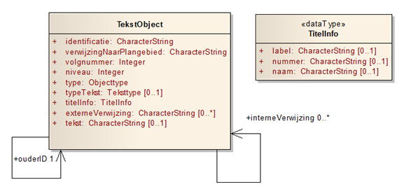

# Het model {#6CD31B94}

In dit hoofdstuk wordt het model zelf uitgebreid beschreven en toegelicht. 
## Algemeen {#6CD31B96}

Objectgerichte planteksten zijn opgebouwd uit objecten van twee klassen: TekstMetadata en TekstObject. TekstMetadata bevat een aantal algemene kenmerken die van toepassing zijn op de tekst en wordt beschreven in hoofdstuk <a href='#6CD320A3'>5</a>. De tekst zelf bestaat uit TekstObjecten (“de inhoud”). 
Bij een klasse, te beschouwen als een groep van objecten met dezelfde eigenschappen, worden attributen gedefinieerd die de eigenschappen van een object van die klasse kunnen bevatten.

<i>Voorbeeld: een tekstobject heeft altijd een attribuut “titel”. De inhoud van dit attribuut is de titel van het tekstobject, bijvoorbeeld ”Wonen” .</i>

De klasse TekstObject is van toepassing op alle instrumenten en heeft één bijzonder onderdeel: de tekst zelf. Dit attribuut is de eigenlijke inhoud. Binnen dit attribuut bevindt zich de tekst zelf, “de cijfers en letters”, evt. noodzakelijke opmaak zoals tabellen, lijsten, nadruk etc. In <a href='#fig-imropt-model-in-totaliteit'>Figuur 1</a> is het IMROPT model als geheel in een UML diagram weergegeven. 
<figure></img>
<figcaption>IMROPT model in totaliteit</figcaption></figure>

## Klasse TekstObject {#1DB047CE}

De tekst is samengesteld uit één of meerdere TekstObjecten, een stuk tekst met een titel. Alle TekstObjecten kennen dezelfde set van mogelijke attributen. De waarde van een attribuut kan uiteraard verschillend zijn. 
De verhouding tussen de verschillende TekstObjecten komt tot uitdrukking in de attributen niveau, volgnummer, ouderId en objecttype en in de volgorde in het document. Het is verplicht de TekstObjecten in de juiste volgorde in het XML document te plaatsen. Het TekstObject met volgnummer 1 wordt als eerste in het document geplaatst, het TekstObject met het hoogste volgnummer als laatste. 
Label, nummer en titel bepalen samen wat de volledige titel, de kop boven de tekst wordt.

<i>Voorbeeld: Hoofdstuk 2 “Beschrijving bestaande situatie” in de toelichting krijgt als label de waarde “Hoofdstuk”, als nummer de waarde “2” en als naam de waarde “Beschrijving bestaande situatie”. De kop wordt dus “Hoofdstuk 2 Beschrijving bestaande situatie”.</i> 
<figure></img>
<figcaption>TekstObject</figcaption></figure>

In tabel Klasse TekstObject wordt de klasse TekstObject beschreven, waarbij per attribuut wordt aangegeven. Welke waarde gewenst is, welke dit moet zijn, of het gebruik van het attribuut verplicht is, 
en of het attribuut meerdere keren mag voorkomen. Na de tabel wordt per attribuut een nadere toelichting gegeven over de toepassing ervan. 
<table style='width: 100%;'><caption>Tabel Klasse TekstObject</caption>
<colgroup><col id='col1' style='width: 25%;'
<col id='col2' style='width: 9.997688395746648%;'
<col id='col3' style='width: 65.00231160425335%;'
</colgroup>
<thead valign='top'><tr><th align='left' style='border-top: 0.5pt solid #666666; border-left: 0.5pt solid #666666; border-bottom: 0.5pt solid #666666; border-right: 0.5pt solid #666666; background-color: #000000;'>Klasse 
</th>
<th align='left' style='border-top: 0.5pt solid #666666; border-left: 0.5pt solid #666666; border-bottom: 0.5pt solid #666666; border-right: 0.5pt solid #666666; background-color: #000000;' colspan='2'>TekstObject 
</th>
</tr>
</thead>
<tbody valign='top'><tr><td align='left' style='border-top: 0.5pt solid #666666; border-left: 0.5pt solid #666666; border-bottom: 0.5pt solid #666666; border-right: 0.5pt solid #666666; background-color: none;'>Definitie 
</td>
<td align='left' style='border-top: 0.5pt solid #666666; border-left: 0.5pt solid #666666; border-bottom: 0.5pt solid #666666; border-right: 0.5pt solid #666666; background-color: none;' colspan='2'>Zelfstandig leesbaar stuk tekst met een titel, dat begint met een hoofdletter en eindigt met een punt. 
</td>
</tr>
<tr><td align='left' style='border-top: 0.5pt solid #666666; border-left: 0.5pt solid #666666; border-bottom: 0.5pt solid #666666; border-right: 0.5pt solid #666666; background-color: none;'>Herkomst definitie  
</td>
<td align='left' style='border-top: 0.5pt solid #666666; border-left: 0.5pt solid #666666; border-bottom: 0.5pt solid #666666; border-right: 0.5pt solid #666666; background-color: none;' colspan='2'>IMROPT 
</td>
</tr>
<tr><td align='left' style='border-top: 0.5pt solid #666666; border-left: 0.5pt solid #666666; border-bottom: 0.5pt solid #666666; border-right: 0.5pt solid #666666; background-color: none;' colspan='3'>Attributen 
</td>
</tr>
<tr><td align='left' style='border-top: 0.5pt solid #666666; border-left: 0.5pt solid #666666; border-bottom: 0.5pt solid #666666; border-right: 0.5pt solid #666666; background-color: none;'><i>Attribuutnaam</i> 
</td>
<td align='left' style='border-top: 0.5pt solid #666666; border-left: 0.5pt solid #666666; border-bottom: 0.5pt solid #666666; border-right: 0.5pt solid #666666; background-color: none;'><b>m*</b> 
</td>
<td align='left' style='border-top: 0.5pt solid #666666; border-left: 0.5pt solid #666666; border-bottom: 0.5pt solid #666666; border-right: 0.5pt solid #666666; background-color: none;'><b>Toelichting</b> 
</td>
</tr>
<tr><td align='left' style='border-top: 0.5pt solid #666666; border-left: 0.5pt solid #666666; border-bottom: 0.5pt solid #666666; border-right: 0.5pt solid #666666; background-color: none;'>identificatie 
</td>
<td align='left' style='border-top: 0.5pt solid #666666; border-left: 0.5pt solid #666666; border-bottom: 0.5pt solid #666666; border-right: 0.5pt solid #666666; background-color: none;'>1 
</td>
<td align='left' style='border-top: 0.5pt solid #666666; border-left: 0.5pt solid #666666; border-bottom: 0.5pt solid #666666; border-right: 0.5pt solid #666666; background-color: none;'>eigen identificatie (idn) van het TekstObject. De code moet uniek zijn binnen het plantekstenbestand. De identificatie begint met "NL.IMRO.PT." en wordt gevolgd door max. 32 alfanumerieke tekens. 
De waarde moet voldoen aan de volgende reguliere expressie: NL\.IMRO\.PT\.[A-Za-z0-9_\-,\.]{1,32} 
</td>
</tr>
<tr><td align='left' style='border-top: 0.5pt solid #666666; border-left: 0.5pt solid #666666; border-bottom: 0.5pt solid #666666; border-right: 0.5pt solid #666666; background-color: none;'>verwijzingNaarPlangebied 
</td>
<td align='left' style='border-top: 0.5pt solid #666666; border-left: 0.5pt solid #666666; border-bottom: 0.5pt solid #666666; border-right: 0.5pt solid #666666; background-color: none;'>1 
</td>
<td align='left' style='border-top: 0.5pt solid #666666; border-left: 0.5pt solid #666666; border-bottom: 0.5pt solid #666666; border-right: 0.5pt solid #666666; background-color: none;'>identificatie (idn) van het IMRO Plangebied waar dit TekstObject bij hoort. 
</td>
</tr>
<tr><td align='left' style='border-top: 0.5pt solid #666666; border-left: 0.5pt solid #666666; border-bottom: 0.5pt solid #666666; border-right: 0.5pt solid #666666; background-color: none;'>volgnummer 
</td>
<td align='left' style='border-top: 0.5pt solid #666666; border-left: 0.5pt solid #666666; border-bottom: 0.5pt solid #666666; border-right: 0.5pt solid #666666; background-color: none;'>1 
</td>
<td align='left' style='border-top: 0.5pt solid #666666; border-left: 0.5pt solid #666666; border-bottom: 0.5pt solid #666666; border-right: 0.5pt solid #666666; background-color: none;'>een oplopend volgnummer 1, 2, 3, ... dat de volgorde van de tekstobjecten aangeeft. 
</td>
</tr>
<tr><td align='left' style='border-top: 0.5pt solid #666666; border-left: 0.5pt solid #666666; border-bottom: 0.5pt solid #666666; border-right: 0.5pt solid #666666; background-color: none;'>niveau 
</td>
<td align='left' style='border-top: 0.5pt solid #666666; border-left: 0.5pt solid #666666; border-bottom: 0.5pt solid #666666; border-right: 0.5pt solid #666666; background-color: none;'>1 
</td>
<td align='left' style='border-top: 0.5pt solid #666666; border-left: 0.5pt solid #666666; border-bottom: 0.5pt solid #666666; border-right: 0.5pt solid #666666; background-color: none;'>een oplopende waarde 0, 1, 2, ... dat het hiërarchische niveau van het object aangeeft. Het object met niveau 0 heeft het hoogste niveau. De waarde mag niet hoger zijn dan 11. 
</td>
</tr>
<tr><td align='left' style='border-top: 0.5pt solid #666666; border-left: 0.5pt solid #666666; border-bottom: 0.5pt solid #666666; border-right: 0.5pt solid #666666; background-color: none;'>ouderId 
</td>
<td align='left' style='border-top: 0.5pt solid #666666; border-left: 0.5pt solid #666666; border-bottom: 0.5pt solid #666666; border-right: 0.5pt solid #666666; background-color: none;'>1 
</td>
<td align='left' style='border-top: 0.5pt solid #666666; border-left: 0.5pt solid #666666; border-bottom: 0.5pt solid #666666; border-right: 0.5pt solid #666666; background-color: none;'>identificatie (idn) van het bovenliggend TekstObject. 
</td>
</tr>
<tr><td align='left' style='border-top: 0.5pt solid #666666; border-left: 0.5pt solid #666666; border-bottom: 0.5pt solid #666666; border-right: 0.5pt solid #666666; background-color: none;'>type 
</td>
<td align='left' style='border-top: 0.5pt solid #666666; border-left: 0.5pt solid #666666; border-bottom: 0.5pt solid #666666; border-right: 0.5pt solid #666666; background-color: none;'>1 
</td>
<td align='left' style='border-top: 0.5pt solid #666666; border-left: 0.5pt solid #666666; border-bottom: 0.5pt solid #666666; border-right: 0.5pt solid #666666; background-color: none;'>type van het object volgens domein ObjecttypePlan, ObjecttypeVisie of ObjecttypeBesluit  
</td>
</tr>
<tr><td align='left' style='border-top: 0.5pt solid #666666; border-left: 0.5pt solid #666666; border-bottom: 0.5pt solid #666666; border-right: 0.5pt solid #666666; background-color: none;'>typeTekst 
</td>
<td align='left' style='border-top: 0.5pt solid #666666; border-left: 0.5pt solid #666666; border-bottom: 0.5pt solid #666666; border-right: 0.5pt solid #666666; background-color: none;'>0..1 
</td>
<td align='left' style='border-top: 0.5pt solid #666666; border-left: 0.5pt solid #666666; border-bottom: 0.5pt solid #666666; border-right: 0.5pt solid #666666; background-color: none;'>aanduiding van het type tekst waarnaar verwezen wordt. Domein: Teksttype. 
</td>
</tr>
<tr><td align='left' style='border-top: 0.5pt solid #666666; border-left: 0.5pt solid #666666; border-bottom: 0.5pt solid #666666; border-right: 0.5pt solid #666666; background-color: none;'>titelInfo 
</td>
<td align='left' style='border-top: 0.5pt solid #666666; border-left: 0.5pt solid #666666; border-bottom: 0.5pt solid #666666; border-right: 0.5pt solid #666666; background-color: none;'>1 
</td>
<td align='left' style='border-top: 0.5pt solid #666666; border-left: 0.5pt solid #666666; border-bottom: 0.5pt solid #666666; border-right: 0.5pt solid #666666; background-color: none;'>TitelInfo: Een samengesteld attribuut: 
<ul><li>label [0..1]: Soortnaam die getoond moet worden, vaak gelijk aan type. Dit is een vrij tekstveld.</li>
<li>nummer [0..1]: aanduiding van het object. Een opvolgende reeks (1,2,3 of A,B,C) wordt geadviseerd.</li>
<li>naam[0..1]: de zelf gekozen naam van het object.</li>
</ul>

</td>
</tr>
<tr><td align='left' style='border-top: 0.5pt solid #666666; border-left: 0.5pt solid #666666; border-bottom: 0.5pt solid #666666; border-right: 0.5pt solid #666666; background-color: none;'>interneVerwijzing 
</td>
<td align='left' style='border-top: 0.5pt solid #666666; border-left: 0.5pt solid #666666; border-bottom: 0.5pt solid #666666; border-right: 0.5pt solid #666666; background-color: none;'>0..n 
</td>
<td align='left' style='border-top: 0.5pt solid #666666; border-left: 0.5pt solid #666666; border-bottom: 0.5pt solid #666666; border-right: 0.5pt solid #666666; background-color: none;'>TekstObject identificatie (idn), koppelt TekstObjecten 
</td>
</tr>
<tr><td align='left' style='border-top: 0.5pt solid #666666; border-left: 0.5pt solid #666666; border-bottom: 0.5pt solid #666666; border-right: 0.5pt solid #666666; background-color: none;'>externeVerwijzing 
</td>
<td align='left' style='border-top: 0.5pt solid #666666; border-left: 0.5pt solid #666666; border-bottom: 0.5pt solid #666666; border-right: 0.5pt solid #666666; background-color: none;'>0..n 
</td>
<td align='left' style='border-top: 0.5pt solid #666666; border-left: 0.5pt solid #666666; border-bottom: 0.5pt solid #666666; border-right: 0.5pt solid #666666; background-color: none;'>verwijzingen naar een ander bronbestand waar het ruimtelijk instrument is opgebouwd of een specifieke locatie daarbinnen. 
</td>
</tr>
<tr><td align='left' style='border-top: 0.5pt solid #666666; border-left: 0.5pt solid #666666; border-bottom: 0.5pt solid #666666; border-right: 0.5pt solid #666666; background-color: none;'>tekstMetadata 
</td>
<td align='left' style='border-top: 0.5pt solid #666666; border-left: 0.5pt solid #666666; border-bottom: 0.5pt solid #666666; border-right: 0.5pt solid #666666; background-color: none;'>0..1 
</td>
<td align='left' style='border-top: 0.5pt solid #666666; border-left: 0.5pt solid #666666; border-bottom: 0.5pt solid #666666; border-right: 0.5pt solid #666666; background-color: none;'>verwijzing naar object TekstMetadata. Alleen van toepassing en verplicht indien het type object gelijk is aan ‘document’ of ‘besluitdocument’. 
</td>
</tr>
<tr><td align='left' style='border-top: 0.5pt solid #666666; border-left: 0.5pt solid #666666; border-bottom: 0.5pt solid #666666; border-right: 0.5pt solid #666666; background-color: none;'>tekst 
</td>
<td align='left' style='border-top: 0.5pt solid #666666; border-left: 0.5pt solid #666666; border-bottom: 0.5pt solid #666666; border-right: 0.5pt solid #666666; background-color: none;'>0..1 
</td>
<td align='left' style='border-top: 0.5pt solid #666666; border-left: 0.5pt solid #666666; border-bottom: 0.5pt solid #666666; border-right: 0.5pt solid #666666; background-color: none;'>de tekst. Wat hier mag worden opgenomen staat beschreven in paragraaf <a href='#6CD31BFC'>2.3</a>. 
</td>
</tr>
<tr><td align='left' style='border-top: 0.5pt solid #666666; border-left: 0.5pt solid #666666; border-bottom: 0.5pt solid #666666; border-right: 0.5pt solid #666666; background-color: none;' colspan='3'>* multipliciteit 
1 = komt 1 keer voor 
1..n = komt 1 of meer keer voor 
0..1 = komt hooguit 1 keer voor 
0..n = komt zo vaak voor als gewenst 
</td>
</tr>
</tbody>
</table>

## Speciale tekstonderdelen {#6CD31BFC}

De inhoud van de tekstelementen is “mixed-content”. Dat betekent dat binnen deze klasse verschillende objecten door elkaar heen kunnen voorkomen. De basis word gevormd door een selectie uit XHTML. Deze wordt aangevuld met voor planteksten van belang geachte specifieke onderdelen.

<b>XHTML elementen</b> 
De volgende XHTML 1.0 elementen (conform <a href='https://www.w3.org/TR/xhtml1/' target='_blank'>W3C</a>) mogen worden gebruikt. Nadere definitie vindt plaats in het IMROPT2012 XML Schema (XSD) en dit modeldocument.

<table style='width: 304.8pt;'><caption>Tabel XHTML elementen</caption>
<colgroup><col id='col1' style='width: 50%;'
<col id='col2' style='width: 50%;'
</colgroup>
<thead valign='top'><tr><th align='left' style='border-top: 0.5pt solid #666666; border-left: 0.5pt solid #666666; border-bottom: 0.5pt solid #666666; border-right: 0.5pt solid #666666; background-color: #000000;'>XHTML element 
</th>
<th align='left' style='border-top: 0.5pt solid #666666; border-left: 0.5pt solid #666666; border-bottom: 0.5pt solid #666666; border-right: 0.5pt solid #666666; background-color: #000000;'>betekenis 
</th>
</tr>
</thead>
<tbody valign='top'><tr><td align='left' style='border-top: 0.5pt solid #666666; border-left: 0.5pt solid #666666; border-bottom: 0.5pt solid #666666; border-right: 0.5pt solid #666666; background-color: none;'>&lt;!--...--&gt; 
</td>
<td align='left' style='border-top: 0.5pt solid #666666; border-left: 0.5pt solid #666666; border-bottom: 0.5pt solid #666666; border-right: 0.5pt solid #666666; background-color: none;'>commentaar 
</td>
</tr>
<tr><td align='left' style='border-top: 0.5pt solid #666666; border-left: 0.5pt solid #666666; border-bottom: 0.5pt solid #666666; border-right: 0.5pt solid #666666; background-color: none;'>&lt;strong&gt; 
</td>
<td align='left' style='border-top: 0.5pt solid #666666; border-left: 0.5pt solid #666666; border-bottom: 0.5pt solid #666666; border-right: 0.5pt solid #666666; background-color: none;'>sterke nadruk 
</td>
</tr>
<tr><td align='left' style='border-top: 0.5pt solid #666666; border-left: 0.5pt solid #666666; border-bottom: 0.5pt solid #666666; border-right: 0.5pt solid #666666; background-color: none;'>&lt;em&gt; 
</td>
<td align='left' style='border-top: 0.5pt solid #666666; border-left: 0.5pt solid #666666; border-bottom: 0.5pt solid #666666; border-right: 0.5pt solid #666666; background-color: none;'>nadruk 
</td>
</tr>
<tr><td align='left' style='border-top: 0.5pt solid #666666; border-left: 0.5pt solid #666666; border-bottom: 0.5pt solid #666666; border-right: 0.5pt solid #666666; background-color: none;'>&lt;sub&gt; 
</td>
<td align='left' style='border-top: 0.5pt solid #666666; border-left: 0.5pt solid #666666; border-bottom: 0.5pt solid #666666; border-right: 0.5pt solid #666666; background-color: none;'>subscript 
</td>
</tr>
<tr><td align='left' style='border-top: 0.5pt solid #666666; border-left: 0.5pt solid #666666; border-bottom: 0.5pt solid #666666; border-right: 0.5pt solid #666666; background-color: none;'>&lt;sup&gt; 
</td>
<td align='left' style='border-top: 0.5pt solid #666666; border-left: 0.5pt solid #666666; border-bottom: 0.5pt solid #666666; border-right: 0.5pt solid #666666; background-color: none;'>superscript 
</td>
</tr>
<tr><td align='left' style='border-top: 0.5pt solid #666666; border-left: 0.5pt solid #666666; border-bottom: 0.5pt solid #666666; border-right: 0.5pt solid #666666; background-color: none;'>&lt;ul&gt; 
</td>
<td align='left' style='border-top: 0.5pt solid #666666; border-left: 0.5pt solid #666666; border-bottom: 0.5pt solid #666666; border-right: 0.5pt solid #666666; background-color: none;'>ongeordende lijst 
</td>
</tr>
<tr><td align='left' style='border-top: 0.5pt solid #666666; border-left: 0.5pt solid #666666; border-bottom: 0.5pt solid #666666; border-right: 0.5pt solid #666666; background-color: none;'>&lt;ol&gt; 
</td>
<td align='left' style='border-top: 0.5pt solid #666666; border-left: 0.5pt solid #666666; border-bottom: 0.5pt solid #666666; border-right: 0.5pt solid #666666; background-color: none;'>geordende lijst 
</td>
</tr>
<tr><td align='left' style='border-top: 0.5pt solid #666666; border-left: 0.5pt solid #666666; border-bottom: 0.5pt solid #666666; border-right: 0.5pt solid #666666; background-color: none;'>&lt;li&gt; 
</td>
<td align='left' style='border-top: 0.5pt solid #666666; border-left: 0.5pt solid #666666; border-bottom: 0.5pt solid #666666; border-right: 0.5pt solid #666666; background-color: none;'>item in een lijst 
</td>
</tr>
<tr><td align='left' style='border-top: 0.5pt solid #666666; border-left: 0.5pt solid #666666; border-bottom: 0.5pt solid #666666; border-right: 0.5pt solid #666666; background-color: none;'>&lt;p&gt; 
</td>
<td align='left' style='border-top: 0.5pt solid #666666; border-left: 0.5pt solid #666666; border-bottom: 0.5pt solid #666666; border-right: 0.5pt solid #666666; background-color: none;'>paragraaf 
</td>
</tr>
<tr><td align='left' style='border-top: 0.5pt solid #666666; border-left: 0.5pt solid #666666; border-bottom: 0.5pt solid #666666; border-right: 0.5pt solid #666666; background-color: none;'>&lt;br&gt; 
</td>
<td align='left' style='border-top: 0.5pt solid #666666; border-left: 0.5pt solid #666666; border-bottom: 0.5pt solid #666666; border-right: 0.5pt solid #666666; background-color: none;'>nieuwe regel 
</td>
</tr>
<tr><td align='left' style='border-top: 0.5pt solid #666666; border-left: 0.5pt solid #666666; border-bottom: 0.5pt solid #666666; border-right: 0.5pt solid #666666; background-color: none;'>&lt;table&gt; 
</td>
<td align='left' style='border-top: 0.5pt solid #666666; border-left: 0.5pt solid #666666; border-bottom: 0.5pt solid #666666; border-right: 0.5pt solid #666666; background-color: none;'>tabel 
</td>
</tr>
<tr><td align='left' style='border-top: 0.5pt solid #666666; border-left: 0.5pt solid #666666; border-bottom: 0.5pt solid #666666; border-right: 0.5pt solid #666666; background-color: none;'>&lt;tr&gt; 
</td>
<td align='left' style='border-top: 0.5pt solid #666666; border-left: 0.5pt solid #666666; border-bottom: 0.5pt solid #666666; border-right: 0.5pt solid #666666; background-color: none;'>rij in tabel 
</td>
</tr>
<tr><td align='left' style='border-top: 0.5pt solid #666666; border-left: 0.5pt solid #666666; border-bottom: 0.5pt solid #666666; border-right: 0.5pt solid #666666; background-color: none;'>&lt;td&gt; 
</td>
<td align='left' style='border-top: 0.5pt solid #666666; border-left: 0.5pt solid #666666; border-bottom: 0.5pt solid #666666; border-right: 0.5pt solid #666666; background-color: none;'>cel in tabel 
</td>
</tr>
<tr><td align='left' style='border-top: 0.5pt solid #666666; border-left: 0.5pt solid #666666; border-bottom: 0.5pt solid #666666; border-right: 0.5pt solid #666666; background-color: none;'>&lt;th&gt; 
</td>
<td align='left' style='border-top: 0.5pt solid #666666; border-left: 0.5pt solid #666666; border-bottom: 0.5pt solid #666666; border-right: 0.5pt solid #666666; background-color: none;'>kop in tabel 
</td>
</tr>
<tr><td align='left' style='border-top: 0.5pt solid #666666; border-left: 0.5pt solid #666666; border-bottom: 0.5pt solid #666666; border-right: 0.5pt solid #666666; background-color: none;'>&lt;img&gt; 
</td>
<td align='left' style='border-top: 0.5pt solid #666666; border-left: 0.5pt solid #666666; border-bottom: 0.5pt solid #666666; border-right: 0.5pt solid #666666; background-color: none;'>afbeelding 
</td>
</tr>
</tbody>
</table>

<b>Verwijzing naar afbeeldingen in de tekst</b> 
In de tekst attributen mag alleen worden verwezen naar afbeeldingen die deel uitmaken van het instrument en die dus ook in samenhang beschikbaar gesteld worden conform de <a href='https://docs.geostandaarden.nl/ro/stri' target='_blank'>STRI2012</a>. Deze afbeeldingen worden middels een &lt;img&gt; tag in de tekst verwerkt. 
Bij het beschikbaar stellen van objectgerichte planteksten is het mogelijk om gebruik te maken van een separaat Cascading Style Sheet (CSS bestand), waarin de gewenste opmaak van de planteksten is vastgelegd. Dit is vastgelegd in de <a href='https://docs.geostandaarden.nl/ro/stri' target='_blank'>STRI2012</a>. De bepaling dat alleen mag worden verwezen naar afbeeldingen die deel uitmaken van het instrument is niet van toepassing op afbeeldingen waar vanuit het CSS bestand naar wordt verwezen.

<b>Toevoegingen voor opsommingen</b> 
Voor de ongeordende lijst &lt;ul&gt; kunnen de volgende “classes” worden gebruikt om specifieke opsommingtekens te gebruiken. Als geen class wordt gebruikt, zal de standaard waarde worden verondersteld conform de volgende tabel: 
<table style='width: 100%;'><caption>Tabel gebruik van classes</caption>
<colgroup><col id='col1' style='width: 21.336610486891384%;'
<col id='col2' style='width: 78.66338951310861%;'
</colgroup>
<thead valign='top'><tr><th align='left' style='border-top: 0.5pt solid #000000; border-left: 0.5pt solid #000000; border-bottom: 0.5pt solid #000000; border-right: 0.5pt solid #000000; background-color: #000000;'><b>Class</b> 
</th>
<th align='left' style='border-top: 0.5pt solid #000000; border-left: 0.5pt solid #000000; border-bottom: 0.5pt solid #000000; border-right: 0.5pt solid #000000; background-color: #000000;'><b>Toelichting</b> 
</th>
</tr>
</thead>
<tbody valign='top'><tr><td align='left' style='border-top: 0.5pt solid #000000; border-left: 0.5pt solid #000000; border-bottom: 0.5pt solid #000000; border-right: 0.5pt solid #000000; background-color: none;'>disc 
</td>
<td align='left' style='border-top: 0.5pt solid #000000; border-left: 0.5pt solid #000000; border-bottom: 0.5pt solid #000000; border-right: 0.5pt solid #000000; background-color: none;'>Een gevulde cirkel. Dit is de standaard waarde van de &lt;ul&gt; 
</td>
</tr>
<tr><td align='left' style='border-top: 0.5pt solid #000000; border-left: 0.5pt solid #000000; border-bottom: 0.5pt solid #000000; border-right: 0.5pt solid #000000; background-color: none;'>circle 
</td>
<td align='left' style='border-top: 0.5pt solid #000000; border-left: 0.5pt solid #000000; border-bottom: 0.5pt solid #000000; border-right: 0.5pt solid #000000; background-color: none;'>Een open cirkel 
</td>
</tr>
<tr><td align='left' style='border-top: 0.5pt solid #000000; border-left: 0.5pt solid #000000; border-bottom: 0.5pt solid #000000; border-right: 0.5pt solid #000000; background-color: none;'>square 
</td>
<td align='left' style='border-top: 0.5pt solid #000000; border-left: 0.5pt solid #000000; border-bottom: 0.5pt solid #000000; border-right: 0.5pt solid #000000; background-color: none;'>Een vierkant 
</td>
</tr>
<tr><td align='left' style='border-top: 0.5pt solid #000000; border-left: 0.5pt solid #000000; border-bottom: 0.5pt solid #000000; border-right: 0.5pt solid #000000; background-color: none;'>nomarker 
</td>
<td align='left' style='border-top: 0.5pt solid #000000; border-left: 0.5pt solid #000000; border-bottom: 0.5pt solid #000000; border-right: 0.5pt solid #000000; background-color: none;'>Er wordt geen opsommingsteken getoond (list-style-type=none) 
</td>
</tr>
</tbody>
</table>

Voor de geordende lijst &lt;ol&gt; kunnen de volgende “classes” worden gebruikt om specifieke opsommingtekens te gebruiken. Als geen class wordt gebruikt, zal de standaard waarde worden verondersteld conform de volgende tabel: 
<table style='width: 100%;'><caption>Tabel gebruik van opsommingen</caption>
<colgroup><col id='col1' style='width: 22.951779026217228%;'
<col id='col2' style='width: 77.04822097378276%;'
</colgroup>
<thead valign='top'><tr><th align='left' style='border-top: 0.5pt solid #000000; border-left: 0.5pt solid #000000; border-bottom: 0.5pt solid #000000; border-right: 0.5pt solid #000000; background-color: #000000;'><b>Class</b> 
</th>
<th align='left' style='border-top: 0.5pt solid #000000; border-left: 0.5pt solid #000000; border-bottom: 0.5pt solid #000000; border-right: 0.5pt solid #000000; background-color: #000000;'><b>Toelichting</b> 
</th>
</tr>
</thead>
<tbody valign='top'><tr><td align='left' style='border-top: 0.5pt solid #000000; border-left: 0.5pt solid #000000; border-bottom: 0.5pt solid #000000; border-right: 0.5pt solid #000000; background-color: none;'>decimal 
</td>
<td align='left' style='border-top: 0.5pt solid #000000; border-left: 0.5pt solid #000000; border-bottom: 0.5pt solid #000000; border-right: 0.5pt solid #000000; background-color: none;'>Een numerieke waarde. Dit is de standaard waarde van de &lt;ol&gt; 
</td>
</tr>
<tr><td align='left' style='border-top: 0.5pt solid #000000; border-left: 0.5pt solid #000000; border-bottom: 0.5pt solid #000000; border-right: 0.5pt solid #000000; background-color: none;'>decimal-leading-zero 
</td>
<td align='left' style='border-top: 0.5pt solid #000000; border-left: 0.5pt solid #000000; border-bottom: 0.5pt solid #000000; border-right: 0.5pt solid #000000; background-color: none;'>Een numerieke waarde met voorloopnul (01, 02, 03, etc.) 
</td>
</tr>
<tr><td align='left' style='border-top: 0.5pt solid #000000; border-left: 0.5pt solid #000000; border-bottom: 0.5pt solid #000000; border-right: 0.5pt solid #000000; background-color: none;'>lower-alpha 
</td>
<td align='left' style='border-top: 0.5pt solid #000000; border-left: 0.5pt solid #000000; border-bottom: 0.5pt solid #000000; border-right: 0.5pt solid #000000; background-color: none;'>Een kleine letter (onderkast) (a, b, c, d, e, etc.) 
</td>
</tr>
<tr><td align='left' style='border-top: 0.5pt solid #000000; border-left: 0.5pt solid #000000; border-bottom: 0.5pt solid #000000; border-right: 0.5pt solid #000000; background-color: none;'>upper-alpha 
</td>
<td align='left' style='border-top: 0.5pt solid #000000; border-left: 0.5pt solid #000000; border-bottom: 0.5pt solid #000000; border-right: 0.5pt solid #000000; background-color: none;'>Een hoofdletter (kapitaal) (A, B, C, D, E, etc.)  
</td>
</tr>
<tr><td align='left' style='border-top: 0.5pt solid #000000; border-left: 0.5pt solid #000000; border-bottom: 0.5pt solid #000000; border-right: 0.5pt solid #000000; background-color: none;'>lower-roman 
</td>
<td align='left' style='border-top: 0.5pt solid #000000; border-left: 0.5pt solid #000000; border-bottom: 0.5pt solid #000000; border-right: 0.5pt solid #000000; background-color: none;'>Een Romeinse numerieke waarde in kleine letter (i, ii, iii, iv, v, etc.) 
</td>
</tr>
<tr><td align='left' style='border-top: 0.5pt solid #000000; border-left: 0.5pt solid #000000; border-bottom: 0.5pt solid #000000; border-right: 0.5pt solid #000000; background-color: none;'>upper-roman 
</td>
<td align='left' style='border-top: 0.5pt solid #000000; border-left: 0.5pt solid #000000; border-bottom: 0.5pt solid #000000; border-right: 0.5pt solid #000000; background-color: none;'>Een Romeinse numerieke waarde in hoofdletter (I, II, III, IV, V, etc.) 
</td>
</tr>
</tbody>
</table>

<table style='width: 100%;'><caption>Toegevoegde IMRO-PT elementen</caption>
<colgroup><col id='col1' style='width: 22.955938475771944%;'
<col id='col2' style='width: 77.04406152422806%;'
</colgroup>
<thead valign='top'><tr><th align='left' style='border-top: 0.5pt solid #000000; border-left: 0.5pt solid #000000; border-bottom: 0.5pt solid #000000; border-right: 0.5pt solid #000000; background-color: #000000;'><b>XHTML element</b> 
</th>
<th align='left' style='border-top: 0.5pt solid #000000; border-left: 0.5pt solid #000000; border-bottom: 0.5pt solid #000000; border-right: 0.5pt solid #000000; background-color: #000000;'><b>Betekenis</b> 
</th>
</tr>
</thead>
<tbody valign='top'><tr><td align='left' style='border-top: 0.5pt solid #000000; border-left: 0.5pt solid #000000; border-bottom: 0.5pt solid #000000; border-right: 0.5pt solid #000000; background-color: none;'>voetnoot 
</td>
<td align='left' style='border-top: 0.5pt solid #000000; border-left: 0.5pt solid #000000; border-bottom: 0.5pt solid #000000; border-right: 0.5pt solid #000000; background-color: none;'>voetnoot 
</td>
</tr>
<tr><td align='left' style='border-top: 0.5pt solid #000000; border-left: 0.5pt solid #000000; border-bottom: 0.5pt solid #000000; border-right: 0.5pt solid #000000; background-color: none;'>verwijderd 
</td>
<td align='left' style='border-top: 0.5pt solid #000000; border-left: 0.5pt solid #000000; border-bottom: 0.5pt solid #000000; border-right: 0.5pt solid #000000; background-color: none;'>Verwijderde tekst, alleen bedoeld voor het markeren van tekst waarvan vermeld wordt dat deze verwijderd wordt (in geval van herzieningen). 
</td>
</tr>
<tr><td align='left' style='border-top: 0.5pt solid #000000; border-left: 0.5pt solid #000000; border-bottom: 0.5pt solid #000000; border-right: 0.5pt solid #000000; background-color: none;'>toegevoegd 
</td>
<td align='left' style='border-top: 0.5pt solid #000000; border-left: 0.5pt solid #000000; border-bottom: 0.5pt solid #000000; border-right: 0.5pt solid #000000; background-color: none;'>Toegevoegde tekst, alleen bedoeld voor het markeren van tekst waarvan vermeld wordt dat deze een toevoeging vormt (in geval van herzieningen) 
</td>
</tr>
<tr><td align='left' style='border-top: 0.5pt solid #000000; border-left: 0.5pt solid #000000; border-bottom: 0.5pt solid #000000; border-right: 0.5pt solid #000000; background-color: none;'>interneVerwijzing 
</td>
<td align='left' style='border-top: 0.5pt solid #000000; border-left: 0.5pt solid #000000; border-bottom: 0.5pt solid #000000; border-right: 0.5pt solid #000000; background-color: none;'>TekstObject identificatie (idn), koppelt TekstObjecten 
</td>
</tr>
<tr><td align='left' style='border-top: 0.5pt solid #000000; border-left: 0.5pt solid #000000; border-bottom: 0.5pt solid #000000; border-right: 0.5pt solid #000000; background-color: none;'>externeVerwijzing 
</td>
<td align='left' style='border-top: 0.5pt solid #000000; border-left: 0.5pt solid #000000; border-bottom: 0.5pt solid #000000; border-right: 0.5pt solid #000000; background-color: none;'>verwijzingen naar een ander bronbestand waar het ruimtelijk instrument is opgebouwd of een specifieke locatie daarbinnen. 
</td>
</tr>
</tbody>
</table>

<b>Verwijzingen</b> 
Een verwijzing verwijst altijd naar een bepaald object in de plantekst. Deze verwijzing moet geïnterpreteerd worden als een verwijzing naar de aangegeven plek in de volledige tekst. In ieder geval moet de onderliggende tekst gemakkelijk bereikbaar zijn.

<i>Voorbeeld: In een bestemmingsplan wordt verwezen worden naar het bestemmingsartikel “Wonen”. Hiermee wordt ook bedoeld de onderliggende leden bestemmingsomschrijving, bouwregels etc.</i>

Verwijzingen worden binnen IMRO geïmplementeerd als XLink href (conform <a href='https://www.w3.org/TR/xlink11/' target='_blank'>W3C</a>). Dit kan een verwijzing binnen het planteksten bronbestand zijn, maar ook een verwijzing naar een ander bronbestand waaruit het instrument is opgebouwd. Binnen de tekst kunnen dezelfde verwijzingstypes worden gebruikt als die mogelijk zijn als attribuut bij het TekstObject, interneVerwijzing en externeVerwijzing.

De opbouw van de href bij een interneVerwijzing is altijd het interne identificatienummer van een TekstObject voorafgegaan door het symbool #, de <i>fragment identifier</i>.

Toelichting: de <i>fragment identifier</i> geeft aan dat binnen een href het volgende fragment een locatie betreft binnen het huidige bestand. Als er geen voorafgaand bestand is gespecificeerd, betreft het dus een locatie binnen het huidige bronbestand. Als de href begint met een # wordt er dus verwezen naar een lokaal object. Dat klopt ook met de bedoeling van de links tussen Tekstobjecten. Als er verwezen wordt naar een extern object, dan begint de href niet met het # maar wordt de fragment identifier facultatief gebruikt om een nadere locatie binnen het externe document aan te duiden.

Hier onder volgen enkele voorbeelden.

<aside class='example'><i>Voorbeeld 1 - Interne verwijzing</i> 
Bij een interne verwijzing is de opbouw voor de href een intern identificatienummer van een TekstObject element voorafgegaan door een # teken.

<pre class="text">&lt;imropt2012:interneVerwijzing xl:type="simple" xl:href="#NL.IMRO.PT.s2"&gt;Hoofdstuk 1 Inleidende bepalingen&lt;/imropt2012:interneVerwijzing&gt; 
</pre>

<i>Voorbeeld 2 - Verwijzing naar een extern bronbestand</i> 
De verwijzing naar een bijlage bronbestand wordt als volgt vormgegeven:

<pre class="text">&lt;imropt2012:externeVerwijzing xl:type="simple" xl:href="b_NL.IMRO.4321.12-0004_bijlage1.pdf"/&gt; 
</pre>

De bestandsnaam in dit voorbeeld is uiteraard fictief. Er dient altijd te worden verwezen naar bronbestanden die onderdeel zijn van het desbetreffende instrument en die dus ook voorkomen in het Geleideformulier, zie <a href='https://docs.geostandaarden.nl/ro/stri' target='_blank'>STRI2012</a>.

<i>Voorbeeld 3 - Externe verwijzing</i> 
Met de fragment identifier # kan tevens een verwijzing worden gemaakt naar een bepaalde locatie binnen een extern object. Bij verwijzingen naar PDF bestanden kan op die manier worden verwezen naar een bepaalde pagina binnen het document, bijvoorbeeld:

<pre class="text">&lt;imropt2012:externeVerwijzing xl:type="simple" 
xl:href="b_NL.IMRO.4321.12-0004_bijlage1.pdf#page=6"/&gt; 
</pre>

bij verwijzingen naar HTML of XHTML bestanden kan er worden verwezen naar specifieke elementen in dit bronbestand, bijvoorbeeld:

<pre class="text">&lt;imropt2012:externeVerwijzing xl:type="simple" xl:href="b_NL.IMRO.4321.12-0004_bijlage1.html#hoofdstuk6"/&gt; 
</pre>

</aside>

<aside class='example'><b><i>Voorbeeld tekstfragment – niet normatief</i></b>

Meer technisch georiënteerde lezers zullen zich gemakkelijker een beeld kunnen vormen van de werking van het tekst attribuut door onderstaand voorbeeld te bekijken:

<i>Het belangrijkste </i><b><i>doel</i></b><i> van dit voorbeeld is duidelijkheid verschaffen. Een verwijzing naar </i>een bijlage<i> is bijvoorbeeld een apart onderdeel. Net zoals een lijst met</i> 
</aside>

<ol><li><i>punt 1</i></li>
<li><i>punt 2</i></li>
<li><i>punt 3</i></li>
</ol>

<aside class='example'>In bovenstaand voorbeeld wordt de inhoud van &lt;tekst&gt; gevormd door 
</aside>

<ul><li>een aantal alfanumerieke tekens (de eigenlijke tekst);</li>
<li>een codering die aangeeft dat “doel” sterke nadruk (strong) moet krijgen;</li>
<li>een codering die van de frase “een bijlage” een verwijzing maakt;</li>
<li>een lijst met 3 items, aangegeven met alfanumerieke tekens.</li>
</ul>

<aside class='example'>In XML code zal dit er als volgt uitzien:

<pre class="text">&lt;tekst&gt;
    &lt;p&gt;Het belangrijkste &lt;strong&gt;doel&lt;/strong&gt;van dit voorbeeld is duidelijkheid verschaffen. Een verwijzing naar &lt;imropt2012:externeVerwijzing xl:type="simple" xl:href="b_NL.IMRO.4321.12-0004_bijlage1.pdf "&gt;een bijlage&lt;/imropt2012:externeVerwijzing&gt; is bijvoorbeeld een apart onderdeel. Net zoals een lijst met&lt;/p&gt;
    &lt;ol class="lower-alpha"&gt;
        &lt;li&gt;punt 1&lt;/li&gt;
        &lt;li&gt;punt 2&lt;/li&gt;
        &lt;li&gt;punt 3&lt;/li&gt;
    &lt;/ol&gt;
&lt;/tekst&gt; 
</pre>

</aside>

