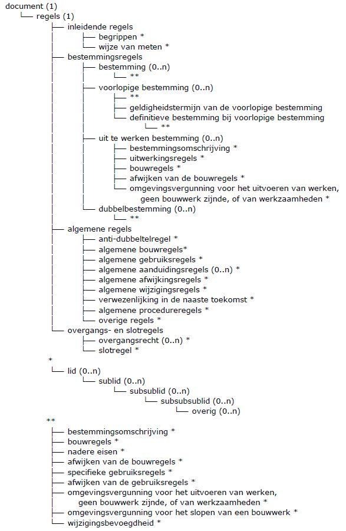

# Basisindeling plannen, visies en besluiten {#6CD31C9F}

In dit hoofdstuk is voor de drie verschillende groepen ruimtelijke instrumenten de volgorde in planteksten aangegeven met behulp van tabellen. Elk TekstObject is benoemd onder de kolom objectType. Hoeveel keer het TekstObject mag voorkomen is aangegeven in de kolom Aantal. Tot slot is in de kolom “Mag voorkomen onder” aangegeven onder welk TekstObject dit TekstObject kan vallen. 
## Basisindeling plannen {#6CD31CA1}

Voor een bestemmingsplan, beheersverordening, inpassingsplan, rijksbestemmingsplan, wijzigingsplan en uitwerkingsplan kan de plantekst op een vaste wijze worden ingedeeld. Planteksten voor deze groep plannen kan in eerste plaats worden verdeeld in regels, bijlagen bij regels, toelichting, bijlagen bij toelichting. Ieder van deze onderdelen wordt verdeeld in hoofdstukken, paragrafen et cetera. De <a href='https://docs.geostandaarden.nl/ro/svbp' target='_blank'>SVBP2012</a> schrijft de indeling van de hoofdstukken en paragrafen van de regels voor. <a href='#'>Tabel 2</a> en <a href='#'>Tabel 3</a> geven samen de indeling voor de regels. In de volgende tabellen wordt de indeling gegeven voor de bijlagen bij de regels (<a href='#d3e3430'>Tabel 6</a>), toelichting (<a href='#d3e3754'>Tabel 7</a>) en de bijlagen bij de toelichting (<a href='#d3e4048'>Tabel 8</a>). In afwijking van onderstaande tabellen mogen bijlagen ook beschikbaar gesteld worden in separate bronbestanden conform <a href='https://docs.geostandaarden.nl/ro/stri' target='_blank'>STRI2012</a>. 
<figure></img>
<figcaption>Hiërarchie objecttypen bij planteksten</figcaption></figure>

<table style='width: 100%;'><caption>Tabel Basisindeling planteksten plannen: bijlagen bij regels</caption>
<colgroup><col id='col1' style='width: 38.09203896540141%;'
<col id='col2' style='width: 9.528608218564552%;'
<col id='col3' style='width: 52.37935281603404%;'
</colgroup>
<thead valign='top'><tr><th align='left' style='border-top: 0.5pt solid #000000; border-left: 0.5pt solid #000000; border-bottom: 0.5pt solid #000000; border-right: 0.5pt solid #000000; background-color: #000000;'><b>objectType</b> 
</th>
<th align='left' style='border-top: 0.5pt solid #000000; border-left: 0.5pt solid #000000; border-bottom: 0.5pt solid #000000; border-right: 0.5pt solid #000000; background-color: #000000;'><b>Aantal</b> 
</th>
<th align='left' style='border-top: 0.5pt solid #000000; border-left: 0.5pt solid #000000; border-bottom: 0.5pt solid #000000; border-right: 0.5pt solid #000000; background-color: #000000;'><b>Mag voorkomen onder</b> 
</th>
</tr>
</thead>
<tbody valign='top'><tr><td align='left' style='border-top: 0.5pt solid #000000; border-left: 0.5pt solid #000000; border-bottom: 0.5pt solid #000000; border-right: 0.5pt solid #000000; background-color: none;'>bijlagen bij regels 
</td>
<td align='left' style='border-top: 0.5pt solid #000000; border-left: 0.5pt solid #000000; border-bottom: 0.5pt solid #000000; border-right: 0.5pt solid #000000; background-color: none;'>0..1 
</td>
<td align='left' style='border-top: 0.5pt solid #000000; border-left: 0.5pt solid #000000; border-bottom: 0.5pt solid #000000; border-right: 0.5pt solid #000000; background-color: none;'>document, regels 
</td>
</tr>
<tr><td align='left' style='border-top: 0.5pt solid #000000; border-left: 0.5pt solid #000000; border-bottom: 0.5pt solid #000000; border-right: 0.5pt solid #000000; background-color: none;'>bijlage bij regels 
</td>
<td align='left' style='border-top: 0.5pt solid #000000; border-left: 0.5pt solid #000000; border-bottom: 0.5pt solid #000000; border-right: 0.5pt solid #000000; background-color: none;'>0..n 
</td>
<td align='left' style='border-top: 0.5pt solid #000000; border-left: 0.5pt solid #000000; border-bottom: 0.5pt solid #000000; border-right: 0.5pt solid #000000; background-color: none;'>bijlagen bij regels 
</td>
</tr>
<tr><td align='left' style='border-top: 0.5pt solid #000000; border-left: 0.5pt solid #000000; border-bottom: 0.5pt solid #000000; border-right: 0.5pt solid #000000; background-color: none;'>deel  
</td>
<td align='left' style='border-top: 0.5pt solid #000000; border-left: 0.5pt solid #000000; border-bottom: 0.5pt solid #000000; border-right: 0.5pt solid #000000; background-color: none;'>0..n 
</td>
<td align='left' style='border-top: 0.5pt solid #000000; border-left: 0.5pt solid #000000; border-bottom: 0.5pt solid #000000; border-right: 0.5pt solid #000000; background-color: none;'>bijlage bij regels 
</td>
</tr>
<tr><td align='left' style='border-top: 0.5pt solid #000000; border-left: 0.5pt solid #000000; border-bottom: 0.5pt solid #000000; border-right: 0.5pt solid #000000; background-color: none;'>hoofdstuk 
</td>
<td align='left' style='border-top: 0.5pt solid #000000; border-left: 0.5pt solid #000000; border-bottom: 0.5pt solid #000000; border-right: 0.5pt solid #000000; background-color: none;'>0..n 
</td>
<td align='left' style='border-top: 0.5pt solid #000000; border-left: 0.5pt solid #000000; border-bottom: 0.5pt solid #000000; border-right: 0.5pt solid #000000; background-color: none;'>bijlage bij regels, Deel 
</td>
</tr>
<tr><td align='left' style='border-top: 0.5pt solid #000000; border-left: 0.5pt solid #000000; border-bottom: 0.5pt solid #000000; border-right: 0.5pt solid #000000; background-color: none;'>paragraaf 
</td>
<td align='left' style='border-top: 0.5pt solid #000000; border-left: 0.5pt solid #000000; border-bottom: 0.5pt solid #000000; border-right: 0.5pt solid #000000; background-color: none;'>0..n 
</td>
<td align='left' style='border-top: 0.5pt solid #000000; border-left: 0.5pt solid #000000; border-bottom: 0.5pt solid #000000; border-right: 0.5pt solid #000000; background-color: none;'>hoofdstuk 
</td>
</tr>
<tr><td align='left' style='border-top: 0.5pt solid #000000; border-left: 0.5pt solid #000000; border-bottom: 0.5pt solid #000000; border-right: 0.5pt solid #000000; background-color: none;'>subparagraaf 
</td>
<td align='left' style='border-top: 0.5pt solid #000000; border-left: 0.5pt solid #000000; border-bottom: 0.5pt solid #000000; border-right: 0.5pt solid #000000; background-color: none;'>0..n 
</td>
<td align='left' style='border-top: 0.5pt solid #000000; border-left: 0.5pt solid #000000; border-bottom: 0.5pt solid #000000; border-right: 0.5pt solid #000000; background-color: none;'>paragraaf 
</td>
</tr>
<tr><td align='left' style='border-top: 0.5pt solid #000000; border-left: 0.5pt solid #000000; border-bottom: 0.5pt solid #000000; border-right: 0.5pt solid #000000; background-color: none;'>subsubparagraaf 
</td>
<td align='left' style='border-top: 0.5pt solid #000000; border-left: 0.5pt solid #000000; border-bottom: 0.5pt solid #000000; border-right: 0.5pt solid #000000; background-color: none;'>0..n 
</td>
<td align='left' style='border-top: 0.5pt solid #000000; border-left: 0.5pt solid #000000; border-bottom: 0.5pt solid #000000; border-right: 0.5pt solid #000000; background-color: none;'>subparagraaf 
</td>
</tr>
<tr><td align='left' style='border-top: 0.5pt solid #000000; border-left: 0.5pt solid #000000; border-bottom: 0.5pt solid #000000; border-right: 0.5pt solid #000000; background-color: none;'>subsubsubparagraaf 
</td>
<td align='left' style='border-top: 0.5pt solid #000000; border-left: 0.5pt solid #000000; border-bottom: 0.5pt solid #000000; border-right: 0.5pt solid #000000; background-color: none;'>0..n 
</td>
<td align='left' style='border-top: 0.5pt solid #000000; border-left: 0.5pt solid #000000; border-bottom: 0.5pt solid #000000; border-right: 0.5pt solid #000000; background-color: none;'>subsubparagraaf 
</td>
</tr>
<tr><td align='left' style='border-top: 0.5pt solid #000000; border-left: 0.5pt solid #000000; border-bottom: 0.5pt solid #000000; border-right: 0.5pt solid #000000; background-color: none;'>overig 
</td>
<td align='left' style='border-top: 0.5pt solid #000000; border-left: 0.5pt solid #000000; border-bottom: 0.5pt solid #000000; border-right: 0.5pt solid #000000; background-color: none;'>0..n 
</td>
<td align='left' style='border-top: 0.5pt solid #000000; border-left: 0.5pt solid #000000; border-bottom: 0.5pt solid #000000; border-right: 0.5pt solid #000000; background-color: none;'>hoofdstuk, paragraaf, subparagraaf, subsubparagraaf, subsubsubparagraaf 
</td>
</tr>
</tbody>
</table>

<table style='width: 100%;'><caption>Tabel Basisindeling planteksten plannen: toelichting</caption>
<colgroup><col id='col1' style='width: 38.09203896540141%;'
<col id='col2' style='width: 9.528608218564552%;'
<col id='col3' style='width: 52.37935281603404%;'
</colgroup>
<thead valign='top'><tr><th align='left' style='border-top: 0.5pt solid #000000; border-left: 0.5pt solid #000000; border-bottom: 0.5pt solid #000000; border-right: 0.5pt solid #000000; background-color: #000000;'><b>objectType</b> 
</th>
<th align='left' style='border-top: 0.5pt solid #000000; border-left: 0.5pt solid #000000; border-bottom: 0.5pt solid #000000; border-right: 0.5pt solid #000000; background-color: #000000;'><b>Aantal</b> 
</th>
<th align='left' style='border-top: 0.5pt solid #000000; border-left: 0.5pt solid #000000; border-bottom: 0.5pt solid #000000; border-right: 0.5pt solid #000000; background-color: #000000;'><b>Mag voorkomen onder</b> 
</th>
</tr>
</thead>
<tbody valign='top'><tr><td align='left' style='border-top: 0.5pt solid #000000; border-left: 0.5pt solid #000000; border-bottom: 0.5pt solid #000000; border-right: 0.5pt solid #000000; background-color: none;'>toelichting 
</td>
<td align='left' style='border-top: 0.5pt solid #000000; border-left: 0.5pt solid #000000; border-bottom: 0.5pt solid #000000; border-right: 0.5pt solid #000000; background-color: none;'>1 
</td>
<td align='left' style='border-top: 0.5pt solid #000000; border-left: 0.5pt solid #000000; border-bottom: 0.5pt solid #000000; border-right: 0.5pt solid #000000; background-color: none;'>document 
</td>
</tr>
<tr><td align='left' style='border-top: 0.5pt solid #000000; border-left: 0.5pt solid #000000; border-bottom: 0.5pt solid #000000; border-right: 0.5pt solid #000000; background-color: none;'>deel 
</td>
<td align='left' style='border-top: 0.5pt solid #000000; border-left: 0.5pt solid #000000; border-bottom: 0.5pt solid #000000; border-right: 0.5pt solid #000000; background-color: none;'>0..n 
</td>
<td align='left' style='border-top: 0.5pt solid #000000; border-left: 0.5pt solid #000000; border-bottom: 0.5pt solid #000000; border-right: 0.5pt solid #000000; background-color: none;'>toelichting 
</td>
</tr>
<tr><td align='left' style='border-top: 0.5pt solid #000000; border-left: 0.5pt solid #000000; border-bottom: 0.5pt solid #000000; border-right: 0.5pt solid #000000; background-color: none;'>hoofdstuk 
</td>
<td align='left' style='border-top: 0.5pt solid #000000; border-left: 0.5pt solid #000000; border-bottom: 0.5pt solid #000000; border-right: 0.5pt solid #000000; background-color: none;'>0..n 
</td>
<td align='left' style='border-top: 0.5pt solid #000000; border-left: 0.5pt solid #000000; border-bottom: 0.5pt solid #000000; border-right: 0.5pt solid #000000; background-color: none;'>toelichting, deel 
</td>
</tr>
<tr><td align='left' style='border-top: 0.5pt solid #000000; border-left: 0.5pt solid #000000; border-bottom: 0.5pt solid #000000; border-right: 0.5pt solid #000000; background-color: none;'>paragraaf 
</td>
<td align='left' style='border-top: 0.5pt solid #000000; border-left: 0.5pt solid #000000; border-bottom: 0.5pt solid #000000; border-right: 0.5pt solid #000000; background-color: none;'>0..n 
</td>
<td align='left' style='border-top: 0.5pt solid #000000; border-left: 0.5pt solid #000000; border-bottom: 0.5pt solid #000000; border-right: 0.5pt solid #000000; background-color: none;'>hoofdstuk 
</td>
</tr>
<tr><td align='left' style='border-top: 0.5pt solid #000000; border-left: 0.5pt solid #000000; border-bottom: 0.5pt solid #000000; border-right: 0.5pt solid #000000; background-color: none;'>subparagraaf 
</td>
<td align='left' style='border-top: 0.5pt solid #000000; border-left: 0.5pt solid #000000; border-bottom: 0.5pt solid #000000; border-right: 0.5pt solid #000000; background-color: none;'>0..n 
</td>
<td align='left' style='border-top: 0.5pt solid #000000; border-left: 0.5pt solid #000000; border-bottom: 0.5pt solid #000000; border-right: 0.5pt solid #000000; background-color: none;'>paragraaf 
</td>
</tr>
<tr><td align='left' style='border-top: 0.5pt solid #000000; border-left: 0.5pt solid #000000; border-bottom: 0.5pt solid #000000; border-right: 0.5pt solid #000000; background-color: none;'>subsubparagraaf 
</td>
<td align='left' style='border-top: 0.5pt solid #000000; border-left: 0.5pt solid #000000; border-bottom: 0.5pt solid #000000; border-right: 0.5pt solid #000000; background-color: none;'>0..n 
</td>
<td align='left' style='border-top: 0.5pt solid #000000; border-left: 0.5pt solid #000000; border-bottom: 0.5pt solid #000000; border-right: 0.5pt solid #000000; background-color: none;'>subparagraaf 
</td>
</tr>
<tr><td align='left' style='border-top: 0.5pt solid #000000; border-left: 0.5pt solid #000000; border-bottom: 0.5pt solid #000000; border-right: 0.5pt solid #000000; background-color: none;'>subsubsubparagraaf 
</td>
<td align='left' style='border-top: 0.5pt solid #000000; border-left: 0.5pt solid #000000; border-bottom: 0.5pt solid #000000; border-right: 0.5pt solid #000000; background-color: none;'>0..n 
</td>
<td align='left' style='border-top: 0.5pt solid #000000; border-left: 0.5pt solid #000000; border-bottom: 0.5pt solid #000000; border-right: 0.5pt solid #000000; background-color: none;'>subsubparagraaf 
</td>
</tr>
<tr><td align='left' style='border-top: 0.5pt solid #000000; border-left: 0.5pt solid #000000; border-bottom: 0.5pt solid #000000; border-right: 0.5pt solid #000000; background-color: none;'>overig 
</td>
<td align='left' style='border-top: 0.5pt solid #000000; border-left: 0.5pt solid #000000; border-bottom: 0.5pt solid #000000; border-right: 0.5pt solid #000000; background-color: none;'>0..n 
</td>
<td align='left' style='border-top: 0.5pt solid #000000; border-left: 0.5pt solid #000000; border-bottom: 0.5pt solid #000000; border-right: 0.5pt solid #000000; background-color: none;'>hoofdstuk, paragraaf, subparagraaf, subsubparagraaf, subsubsubparagraaf 
</td>
</tr>
</tbody>
</table>

<table style='width: 100%;'><caption>Tabel Basisindeling planteksten plannen: bijlagen bij toelichting</caption>
<colgroup><col id='col1' style='width: 38.09203896540141%;'
<col id='col2' style='width: 9.528608218564552%;'
<col id='col3' style='width: 52.37935281603404%;'
</colgroup>
<thead valign='top'><tr><th align='left' style='border-top: 0.5pt solid #000000; border-left: 0.5pt solid #000000; border-bottom: 0.5pt solid #000000; border-right: 0.5pt solid #000000; background-color: #000000;'><b>objectType</b> 
</th>
<th align='left' style='border-top: 0.5pt solid #000000; border-left: 0.5pt solid #000000; border-bottom: 0.5pt solid #000000; border-right: 0.5pt solid #000000; background-color: #000000;'><b>Aantal</b> 
</th>
<th align='left' style='border-top: 0.5pt solid #000000; border-left: 0.5pt solid #000000; border-bottom: 0.5pt solid #000000; border-right: 0.5pt solid #000000; background-color: #000000;'><b>Mag voorkomen onder</b> 
</th>
</tr>
</thead>
<tbody valign='top'><tr><td align='left' style='border-top: 0.5pt solid #000000; border-left: 0.5pt solid #000000; border-bottom: 0.5pt solid #000000; border-right: 0.5pt solid #000000; background-color: none;'>bijlagen bij toelichting 
</td>
<td align='left' style='border-top: 0.5pt solid #000000; border-left: 0.5pt solid #000000; border-bottom: 0.5pt solid #000000; border-right: 0.5pt solid #000000; background-color: none;'>0..1 
</td>
<td align='left' style='border-top: 0.5pt solid #000000; border-left: 0.5pt solid #000000; border-bottom: 0.5pt solid #000000; border-right: 0.5pt solid #000000; background-color: none;'>document, toelichting 
</td>
</tr>
<tr><td align='left' style='border-top: 0.5pt solid #000000; border-left: 0.5pt solid #000000; border-bottom: 0.5pt solid #000000; border-right: 0.5pt solid #000000; background-color: none;'>bijlage bij toelichting 
</td>
<td align='left' style='border-top: 0.5pt solid #000000; border-left: 0.5pt solid #000000; border-bottom: 0.5pt solid #000000; border-right: 0.5pt solid #000000; background-color: none;'>0..n 
</td>
<td align='left' style='border-top: 0.5pt solid #000000; border-left: 0.5pt solid #000000; border-bottom: 0.5pt solid #000000; border-right: 0.5pt solid #000000; background-color: none;'>bijlagen bij toelichting 
</td>
</tr>
<tr><td align='left' style='border-top: 0.5pt solid #000000; border-left: 0.5pt solid #000000; border-bottom: 0.5pt solid #000000; border-right: 0.5pt solid #000000; background-color: none;'>deel 
</td>
<td align='left' style='border-top: 0.5pt solid #000000; border-left: 0.5pt solid #000000; border-bottom: 0.5pt solid #000000; border-right: 0.5pt solid #000000; background-color: none;'>0..n 
</td>
<td align='left' style='border-top: 0.5pt solid #000000; border-left: 0.5pt solid #000000; border-bottom: 0.5pt solid #000000; border-right: 0.5pt solid #000000; background-color: none;'>bijlage bij toelichting 
</td>
</tr>
<tr><td align='left' style='border-top: 0.5pt solid #000000; border-left: 0.5pt solid #000000; border-bottom: 0.5pt solid #000000; border-right: 0.5pt solid #000000; background-color: none;'>hoofdstuk 
</td>
<td align='left' style='border-top: 0.5pt solid #000000; border-left: 0.5pt solid #000000; border-bottom: 0.5pt solid #000000; border-right: 0.5pt solid #000000; background-color: none;'>0..n 
</td>
<td align='left' style='border-top: 0.5pt solid #000000; border-left: 0.5pt solid #000000; border-bottom: 0.5pt solid #000000; border-right: 0.5pt solid #000000; background-color: none;'>bijlage bij toelichting, deel 
</td>
</tr>
<tr><td align='left' style='border-top: 0.5pt solid #000000; border-left: 0.5pt solid #000000; border-bottom: 0.5pt solid #000000; border-right: 0.5pt solid #000000; background-color: none;'>paragraaf 
</td>
<td align='left' style='border-top: 0.5pt solid #000000; border-left: 0.5pt solid #000000; border-bottom: 0.5pt solid #000000; border-right: 0.5pt solid #000000; background-color: none;'>0..n 
</td>
<td align='left' style='border-top: 0.5pt solid #000000; border-left: 0.5pt solid #000000; border-bottom: 0.5pt solid #000000; border-right: 0.5pt solid #000000; background-color: none;'>hoofdstuk 
</td>
</tr>
<tr><td align='left' style='border-top: 0.5pt solid #000000; border-left: 0.5pt solid #000000; border-bottom: 0.5pt solid #000000; border-right: 0.5pt solid #000000; background-color: none;'>subparagraaf 
</td>
<td align='left' style='border-top: 0.5pt solid #000000; border-left: 0.5pt solid #000000; border-bottom: 0.5pt solid #000000; border-right: 0.5pt solid #000000; background-color: none;'>0..n 
</td>
<td align='left' style='border-top: 0.5pt solid #000000; border-left: 0.5pt solid #000000; border-bottom: 0.5pt solid #000000; border-right: 0.5pt solid #000000; background-color: none;'>paragraaf 
</td>
</tr>
<tr><td align='left' style='border-top: 0.5pt solid #000000; border-left: 0.5pt solid #000000; border-bottom: 0.5pt solid #000000; border-right: 0.5pt solid #000000; background-color: none;'>subsubparagraaf 
</td>
<td align='left' style='border-top: 0.5pt solid #000000; border-left: 0.5pt solid #000000; border-bottom: 0.5pt solid #000000; border-right: 0.5pt solid #000000; background-color: none;'>0..n 
</td>
<td align='left' style='border-top: 0.5pt solid #000000; border-left: 0.5pt solid #000000; border-bottom: 0.5pt solid #000000; border-right: 0.5pt solid #000000; background-color: none;'>subparagraaf 
</td>
</tr>
<tr><td align='left' style='border-top: 0.5pt solid #000000; border-left: 0.5pt solid #000000; border-bottom: 0.5pt solid #000000; border-right: 0.5pt solid #000000; background-color: none;'>subsubsubparagraaf 
</td>
<td align='left' style='border-top: 0.5pt solid #000000; border-left: 0.5pt solid #000000; border-bottom: 0.5pt solid #000000; border-right: 0.5pt solid #000000; background-color: none;'>0..n 
</td>
<td align='left' style='border-top: 0.5pt solid #000000; border-left: 0.5pt solid #000000; border-bottom: 0.5pt solid #000000; border-right: 0.5pt solid #000000; background-color: none;'>subsubparagraaf 
</td>
</tr>
<tr><td align='left' style='border-top: 0.5pt solid #000000; border-left: 0.5pt solid #000000; border-bottom: 0.5pt solid #000000; border-right: 0.5pt solid #000000; background-color: none;'>overig 
</td>
<td align='left' style='border-top: 0.5pt solid #000000; border-left: 0.5pt solid #000000; border-bottom: 0.5pt solid #000000; border-right: 0.5pt solid #000000; background-color: none;'>0..n 
</td>
<td align='left' style='border-top: 0.5pt solid #000000; border-left: 0.5pt solid #000000; border-bottom: 0.5pt solid #000000; border-right: 0.5pt solid #000000; background-color: none;'>hoofdstuk, paragraaf, subparagraaf, subsubparagraaf, subsubsubparagraaf 
</td>
</tr>
</tbody>
</table>

## Basisindeling Visies {#6CD31E7C}

Structuurvisies kennen in vergelijking met de plannen een vrijere basisindeling. Planteksten voor deze groep visies kan in eerste plaats worden verdeeld in beleidstekst, bijlagen, toelichting, bijlagen bij toelichting. Ieder van deze onderdelen wordt verdeeld in hoofdstukken, paragrafen et cetera. <a href='#d3e4452'>Tabel 9</a> geeft de indeling voor de beleidstekst. In de volgende tabellen wordt de indeling gegeven voor de bijlagen (<a href='#d3e4817'>Tabel 10</a>), toelichting (<a href='#d3e5145'>Tabel 11</a>) en de bijlagen bij de toelichting (<a href='#d3e5442'>Tabel 12</a>). In afwijking van onderstaande tabellen mogen bijlagen ook beschikbaar gesteld worden in separate bronbestanden conform <a href='https://docs.geostandaarden.nl/ro/stri' target='_blank'>STRI2012</a>. 
<table style='width: 100%;'><caption>Tabel Basisindeling planteksten visies: beleidstekst</caption>
<colgroup><col id='col1' style='width: 38.09203896540141%;'
<col id='col2' style='width: 9.528608218564552%;'
<col id='col3' style='width: 52.37935281603404%;'
</colgroup>
<thead valign='top'><tr><th align='left' style='border-top: 0.5pt solid #000000; border-left: 0.5pt solid #000000; border-bottom: 0.5pt solid #000000; border-right: 0.5pt solid #000000; background-color: #000000;'><b>objectType</b> 
</th>
<th align='left' style='border-top: 0.5pt solid #000000; border-left: 0.5pt solid #000000; border-bottom: 0.5pt solid #000000; border-right: 0.5pt solid #000000; background-color: #000000;'><b>Aantal</b> 
</th>
<th align='left' style='border-top: 0.5pt solid #000000; border-left: 0.5pt solid #000000; border-bottom: 0.5pt solid #000000; border-right: 0.5pt solid #000000; background-color: #000000;'><b>Mag voorkomen onder</b> 
</th>
</tr>
</thead>
<tbody valign='top'><tr><td align='left' style='border-top: 0.5pt solid #000000; border-left: 0.5pt solid #000000; border-bottom: 0.5pt solid #000000; border-right: 0.5pt solid #000000; background-color: none;'>document 
</td>
<td align='left' style='border-top: 0.5pt solid #000000; border-left: 0.5pt solid #000000; border-bottom: 0.5pt solid #000000; border-right: 0.5pt solid #000000; background-color: none;'>1 
</td>
<td align='left' style='border-top: 0.5pt solid #000000; border-left: 0.5pt solid #000000; border-bottom: 0.5pt solid #000000; border-right: 0.5pt solid #000000; background-color: none;'></td>
</tr>
<tr><td align='left' style='border-top: 0.5pt solid #000000; border-left: 0.5pt solid #000000; border-bottom: 0.5pt solid #000000; border-right: 0.5pt solid #000000; background-color: none;'>beleidstekst 
</td>
<td align='left' style='border-top: 0.5pt solid #000000; border-left: 0.5pt solid #000000; border-bottom: 0.5pt solid #000000; border-right: 0.5pt solid #000000; background-color: none;'>1 
</td>
<td align='left' style='border-top: 0.5pt solid #000000; border-left: 0.5pt solid #000000; border-bottom: 0.5pt solid #000000; border-right: 0.5pt solid #000000; background-color: none;'>document 
</td>
</tr>
<tr><td align='left' style='border-top: 0.5pt solid #000000; border-left: 0.5pt solid #000000; border-bottom: 0.5pt solid #000000; border-right: 0.5pt solid #000000; background-color: none;'>band 
</td>
<td align='left' style='border-top: 0.5pt solid #000000; border-left: 0.5pt solid #000000; border-bottom: 0.5pt solid #000000; border-right: 0.5pt solid #000000; background-color: none;'>0..n 
</td>
<td align='left' style='border-top: 0.5pt solid #000000; border-left: 0.5pt solid #000000; border-bottom: 0.5pt solid #000000; border-right: 0.5pt solid #000000; background-color: none;'>beleidstekst 
</td>
</tr>
<tr><td align='left' style='border-top: 0.5pt solid #000000; border-left: 0.5pt solid #000000; border-bottom: 0.5pt solid #000000; border-right: 0.5pt solid #000000; background-color: none;'>deel 
</td>
<td align='left' style='border-top: 0.5pt solid #000000; border-left: 0.5pt solid #000000; border-bottom: 0.5pt solid #000000; border-right: 0.5pt solid #000000; background-color: none;'>0..n 
</td>
<td align='left' style='border-top: 0.5pt solid #000000; border-left: 0.5pt solid #000000; border-bottom: 0.5pt solid #000000; border-right: 0.5pt solid #000000; background-color: none;'>beleidstekst, band 
</td>
</tr>
<tr><td align='left' style='border-top: 0.5pt solid #000000; border-left: 0.5pt solid #000000; border-bottom: 0.5pt solid #000000; border-right: 0.5pt solid #000000; background-color: none;'>hoofdstuk 
</td>
<td align='left' style='border-top: 0.5pt solid #000000; border-left: 0.5pt solid #000000; border-bottom: 0.5pt solid #000000; border-right: 0.5pt solid #000000; background-color: none;'>0..n 
</td>
<td align='left' style='border-top: 0.5pt solid #000000; border-left: 0.5pt solid #000000; border-bottom: 0.5pt solid #000000; border-right: 0.5pt solid #000000; background-color: none;'>beleidstekst, band, deel 
</td>
</tr>
<tr><td align='left' style='border-top: 0.5pt solid #000000; border-left: 0.5pt solid #000000; border-bottom: 0.5pt solid #000000; border-right: 0.5pt solid #000000; background-color: none;'>paragraaf 
</td>
<td align='left' style='border-top: 0.5pt solid #000000; border-left: 0.5pt solid #000000; border-bottom: 0.5pt solid #000000; border-right: 0.5pt solid #000000; background-color: none;'>0..n 
</td>
<td align='left' style='border-top: 0.5pt solid #000000; border-left: 0.5pt solid #000000; border-bottom: 0.5pt solid #000000; border-right: 0.5pt solid #000000; background-color: none;'>hoofdstuk 
</td>
</tr>
<tr><td align='left' style='border-top: 0.5pt solid #000000; border-left: 0.5pt solid #000000; border-bottom: 0.5pt solid #000000; border-right: 0.5pt solid #000000; background-color: none;'>subparagraaf 
</td>
<td align='left' style='border-top: 0.5pt solid #000000; border-left: 0.5pt solid #000000; border-bottom: 0.5pt solid #000000; border-right: 0.5pt solid #000000; background-color: none;'>0..n 
</td>
<td align='left' style='border-top: 0.5pt solid #000000; border-left: 0.5pt solid #000000; border-bottom: 0.5pt solid #000000; border-right: 0.5pt solid #000000; background-color: none;'>paragraaf 
</td>
</tr>
<tr><td align='left' style='border-top: 0.5pt solid #000000; border-left: 0.5pt solid #000000; border-bottom: 0.5pt solid #000000; border-right: 0.5pt solid #000000; background-color: none;'>subsubparagraaf 
</td>
<td align='left' style='border-top: 0.5pt solid #000000; border-left: 0.5pt solid #000000; border-bottom: 0.5pt solid #000000; border-right: 0.5pt solid #000000; background-color: none;'>0..n 
</td>
<td align='left' style='border-top: 0.5pt solid #000000; border-left: 0.5pt solid #000000; border-bottom: 0.5pt solid #000000; border-right: 0.5pt solid #000000; background-color: none;'>subparagraaf 
</td>
</tr>
<tr><td align='left' style='border-top: 0.5pt solid #000000; border-left: 0.5pt solid #000000; border-bottom: 0.5pt solid #000000; border-right: 0.5pt solid #000000; background-color: none;'>subsubsubparagraaf 
</td>
<td align='left' style='border-top: 0.5pt solid #000000; border-left: 0.5pt solid #000000; border-bottom: 0.5pt solid #000000; border-right: 0.5pt solid #000000; background-color: none;'>0..n 
</td>
<td align='left' style='border-top: 0.5pt solid #000000; border-left: 0.5pt solid #000000; border-bottom: 0.5pt solid #000000; border-right: 0.5pt solid #000000; background-color: none;'>subsubparagraaf 
</td>
</tr>
<tr><td align='left' style='border-top: 0.5pt solid #000000; border-left: 0.5pt solid #000000; border-bottom: 0.5pt solid #000000; border-right: 0.5pt solid #000000; background-color: none;'>overig 
</td>
<td align='left' style='border-top: 0.5pt solid #000000; border-left: 0.5pt solid #000000; border-bottom: 0.5pt solid #000000; border-right: 0.5pt solid #000000; background-color: none;'>0..n 
</td>
<td align='left' style='border-top: 0.5pt solid #000000; border-left: 0.5pt solid #000000; border-bottom: 0.5pt solid #000000; border-right: 0.5pt solid #000000; background-color: none;'>hoofdstuk, paragraaf, subparagraaf, subsubparagraaf, subsubsubparagraaf 
</td>
</tr>
</tbody>
</table>

<table style='width: 100%;'><caption>Tabel Basisindeling planteksten visies: bijlagen</caption>
<colgroup><col id='col1' style='width: 38.09203896540141%;'
<col id='col2' style='width: 9.528608218564552%;'
<col id='col3' style='width: 52.37935281603404%;'
</colgroup>
<thead valign='top'><tr><th align='left' style='border-top: 0.5pt solid #000000; border-left: 0.5pt solid #000000; border-bottom: 0.5pt solid #000000; border-right: 0.5pt solid #000000; background-color: #000000;'><b>objectType</b> 
</th>
<th align='left' style='border-top: 0.5pt solid #000000; border-left: 0.5pt solid #000000; border-bottom: 0.5pt solid #000000; border-right: 0.5pt solid #000000; background-color: #000000;'><b>Aantal</b> 
</th>
<th align='left' style='border-top: 0.5pt solid #000000; border-left: 0.5pt solid #000000; border-bottom: 0.5pt solid #000000; border-right: 0.5pt solid #000000; background-color: #000000;'><b>Mag voorkomen onder</b> 
</th>
</tr>
</thead>
<tbody valign='top'><tr><td align='left' style='border-top: 0.5pt solid #000000; border-left: 0.5pt solid #000000; border-bottom: 0.5pt solid #000000; border-right: 0.5pt solid #000000; background-color: none;'>bijlagen 
</td>
<td align='left' style='border-top: 0.5pt solid #000000; border-left: 0.5pt solid #000000; border-bottom: 0.5pt solid #000000; border-right: 0.5pt solid #000000; background-color: none;'>0..1 
</td>
<td align='left' style='border-top: 0.5pt solid #000000; border-left: 0.5pt solid #000000; border-bottom: 0.5pt solid #000000; border-right: 0.5pt solid #000000; background-color: none;'>document, beleidstekst 
</td>
</tr>
<tr><td align='left' style='border-top: 0.5pt solid #000000; border-left: 0.5pt solid #000000; border-bottom: 0.5pt solid #000000; border-right: 0.5pt solid #000000; background-color: none;'>bijlage 
</td>
<td align='left' style='border-top: 0.5pt solid #000000; border-left: 0.5pt solid #000000; border-bottom: 0.5pt solid #000000; border-right: 0.5pt solid #000000; background-color: none;'>0..n 
</td>
<td align='left' style='border-top: 0.5pt solid #000000; border-left: 0.5pt solid #000000; border-bottom: 0.5pt solid #000000; border-right: 0.5pt solid #000000; background-color: none;'>bijlagen 
</td>
</tr>
<tr><td align='left' style='border-top: 0.5pt solid #000000; border-left: 0.5pt solid #000000; border-bottom: 0.5pt solid #000000; border-right: 0.5pt solid #000000; background-color: none;'>deel  
</td>
<td align='left' style='border-top: 0.5pt solid #000000; border-left: 0.5pt solid #000000; border-bottom: 0.5pt solid #000000; border-right: 0.5pt solid #000000; background-color: none;'>0..n 
</td>
<td align='left' style='border-top: 0.5pt solid #000000; border-left: 0.5pt solid #000000; border-bottom: 0.5pt solid #000000; border-right: 0.5pt solid #000000; background-color: none;'>bijlage 
</td>
</tr>
<tr><td align='left' style='border-top: 0.5pt solid #000000; border-left: 0.5pt solid #000000; border-bottom: 0.5pt solid #000000; border-right: 0.5pt solid #000000; background-color: none;'>hoofdstuk 
</td>
<td align='left' style='border-top: 0.5pt solid #000000; border-left: 0.5pt solid #000000; border-bottom: 0.5pt solid #000000; border-right: 0.5pt solid #000000; background-color: none;'>0..n 
</td>
<td align='left' style='border-top: 0.5pt solid #000000; border-left: 0.5pt solid #000000; border-bottom: 0.5pt solid #000000; border-right: 0.5pt solid #000000; background-color: none;'>bijlage, deel 
</td>
</tr>
<tr><td align='left' style='border-top: 0.5pt solid #000000; border-left: 0.5pt solid #000000; border-bottom: 0.5pt solid #000000; border-right: 0.5pt solid #000000; background-color: none;'>paragraaf 
</td>
<td align='left' style='border-top: 0.5pt solid #000000; border-left: 0.5pt solid #000000; border-bottom: 0.5pt solid #000000; border-right: 0.5pt solid #000000; background-color: none;'>0..n 
</td>
<td align='left' style='border-top: 0.5pt solid #000000; border-left: 0.5pt solid #000000; border-bottom: 0.5pt solid #000000; border-right: 0.5pt solid #000000; background-color: none;'>hoofdstuk 
</td>
</tr>
<tr><td align='left' style='border-top: 0.5pt solid #000000; border-left: 0.5pt solid #000000; border-bottom: 0.5pt solid #000000; border-right: 0.5pt solid #000000; background-color: none;'>subparagraaf 
</td>
<td align='left' style='border-top: 0.5pt solid #000000; border-left: 0.5pt solid #000000; border-bottom: 0.5pt solid #000000; border-right: 0.5pt solid #000000; background-color: none;'>0..n 
</td>
<td align='left' style='border-top: 0.5pt solid #000000; border-left: 0.5pt solid #000000; border-bottom: 0.5pt solid #000000; border-right: 0.5pt solid #000000; background-color: none;'>paragraaf 
</td>
</tr>
<tr><td align='left' style='border-top: 0.5pt solid #000000; border-left: 0.5pt solid #000000; border-bottom: 0.5pt solid #000000; border-right: 0.5pt solid #000000; background-color: none;'>subsubparagraaf 
</td>
<td align='left' style='border-top: 0.5pt solid #000000; border-left: 0.5pt solid #000000; border-bottom: 0.5pt solid #000000; border-right: 0.5pt solid #000000; background-color: none;'>0..n 
</td>
<td align='left' style='border-top: 0.5pt solid #000000; border-left: 0.5pt solid #000000; border-bottom: 0.5pt solid #000000; border-right: 0.5pt solid #000000; background-color: none;'>subparagraaf 
</td>
</tr>
<tr><td align='left' style='border-top: 0.5pt solid #000000; border-left: 0.5pt solid #000000; border-bottom: 0.5pt solid #000000; border-right: 0.5pt solid #000000; background-color: none;'>subsubsubparagraaf 
</td>
<td align='left' style='border-top: 0.5pt solid #000000; border-left: 0.5pt solid #000000; border-bottom: 0.5pt solid #000000; border-right: 0.5pt solid #000000; background-color: none;'>0..n 
</td>
<td align='left' style='border-top: 0.5pt solid #000000; border-left: 0.5pt solid #000000; border-bottom: 0.5pt solid #000000; border-right: 0.5pt solid #000000; background-color: none;'>subsubparagraaf 
</td>
</tr>
<tr><td align='left' style='border-top: 0.5pt solid #000000; border-left: 0.5pt solid #000000; border-bottom: 0.5pt solid #000000; border-right: 0.5pt solid #000000; background-color: none;'>overig 
</td>
<td align='left' style='border-top: 0.5pt solid #000000; border-left: 0.5pt solid #000000; border-bottom: 0.5pt solid #000000; border-right: 0.5pt solid #000000; background-color: none;'>0..n 
</td>
<td align='left' style='border-top: 0.5pt solid #000000; border-left: 0.5pt solid #000000; border-bottom: 0.5pt solid #000000; border-right: 0.5pt solid #000000; background-color: none;'>hoofdstuk, paragraaf, subparagraaf, subsubparagraaf, subsubsubparagraaf 
</td>
</tr>
</tbody>
</table>

<table style='width: 100%;'><caption>Tabel Basisindeling planteksten visies: toelichting</caption>
<colgroup><col id='col1' style='width: 38.09203896540141%;'
<col id='col2' style='width: 9.528608218564552%;'
<col id='col3' style='width: 52.37935281603404%;'
</colgroup>
<thead valign='top'><tr><th align='left' style='border-top: 0.5pt solid #000000; border-left: 0.5pt solid #000000; border-bottom: 0.5pt solid #000000; border-right: 0.5pt solid #000000; background-color: #000000;'><b>objectType</b> 
</th>
<th align='left' style='border-top: 0.5pt solid #000000; border-left: 0.5pt solid #000000; border-bottom: 0.5pt solid #000000; border-right: 0.5pt solid #000000; background-color: #000000;'><b>Aantal</b> 
</th>
<th align='left' style='border-top: 0.5pt solid #000000; border-left: 0.5pt solid #000000; border-bottom: 0.5pt solid #000000; border-right: 0.5pt solid #000000; background-color: #000000;'><b>Toegestane Bovenliggende objecten</b> 
</th>
</tr>
</thead>
<tbody valign='top'><tr><td align='left' style='border-top: 0.5pt solid #000000; border-left: 0.5pt solid #000000; border-bottom: 0.5pt solid #000000; border-right: 0.5pt solid #000000; background-color: none;'>toelichting 
</td>
<td align='left' style='border-top: 0.5pt solid #000000; border-left: 0.5pt solid #000000; border-bottom: 0.5pt solid #000000; border-right: 0.5pt solid #000000; background-color: none;'>0..1 
</td>
<td align='left' style='border-top: 0.5pt solid #000000; border-left: 0.5pt solid #000000; border-bottom: 0.5pt solid #000000; border-right: 0.5pt solid #000000; background-color: none;'>document 
</td>
</tr>
<tr><td align='left' style='border-top: 0.5pt solid #000000; border-left: 0.5pt solid #000000; border-bottom: 0.5pt solid #000000; border-right: 0.5pt solid #000000; background-color: none;'>deel 
</td>
<td align='left' style='border-top: 0.5pt solid #000000; border-left: 0.5pt solid #000000; border-bottom: 0.5pt solid #000000; border-right: 0.5pt solid #000000; background-color: none;'>0..n 
</td>
<td align='left' style='border-top: 0.5pt solid #000000; border-left: 0.5pt solid #000000; border-bottom: 0.5pt solid #000000; border-right: 0.5pt solid #000000; background-color: none;'>toelichting 
</td>
</tr>
<tr><td align='left' style='border-top: 0.5pt solid #000000; border-left: 0.5pt solid #000000; border-bottom: 0.5pt solid #000000; border-right: 0.5pt solid #000000; background-color: none;'>hoofdstuk 
</td>
<td align='left' style='border-top: 0.5pt solid #000000; border-left: 0.5pt solid #000000; border-bottom: 0.5pt solid #000000; border-right: 0.5pt solid #000000; background-color: none;'>0..n 
</td>
<td align='left' style='border-top: 0.5pt solid #000000; border-left: 0.5pt solid #000000; border-bottom: 0.5pt solid #000000; border-right: 0.5pt solid #000000; background-color: none;'>toelichting, deel 
</td>
</tr>
<tr><td align='left' style='border-top: 0.5pt solid #000000; border-left: 0.5pt solid #000000; border-bottom: 0.5pt solid #000000; border-right: 0.5pt solid #000000; background-color: none;'>paragraaf 
</td>
<td align='left' style='border-top: 0.5pt solid #000000; border-left: 0.5pt solid #000000; border-bottom: 0.5pt solid #000000; border-right: 0.5pt solid #000000; background-color: none;'>0..n 
</td>
<td align='left' style='border-top: 0.5pt solid #000000; border-left: 0.5pt solid #000000; border-bottom: 0.5pt solid #000000; border-right: 0.5pt solid #000000; background-color: none;'>hoofdstuk 
</td>
</tr>
<tr><td align='left' style='border-top: 0.5pt solid #000000; border-left: 0.5pt solid #000000; border-bottom: 0.5pt solid #000000; border-right: 0.5pt solid #000000; background-color: none;'>subparagraaf 
</td>
<td align='left' style='border-top: 0.5pt solid #000000; border-left: 0.5pt solid #000000; border-bottom: 0.5pt solid #000000; border-right: 0.5pt solid #000000; background-color: none;'>0..n 
</td>
<td align='left' style='border-top: 0.5pt solid #000000; border-left: 0.5pt solid #000000; border-bottom: 0.5pt solid #000000; border-right: 0.5pt solid #000000; background-color: none;'>paragraaf 
</td>
</tr>
<tr><td align='left' style='border-top: 0.5pt solid #000000; border-left: 0.5pt solid #000000; border-bottom: 0.5pt solid #000000; border-right: 0.5pt solid #000000; background-color: none;'>subsubparagraaf 
</td>
<td align='left' style='border-top: 0.5pt solid #000000; border-left: 0.5pt solid #000000; border-bottom: 0.5pt solid #000000; border-right: 0.5pt solid #000000; background-color: none;'>0..n 
</td>
<td align='left' style='border-top: 0.5pt solid #000000; border-left: 0.5pt solid #000000; border-bottom: 0.5pt solid #000000; border-right: 0.5pt solid #000000; background-color: none;'>subparagraaf 
</td>
</tr>
<tr><td align='left' style='border-top: 0.5pt solid #000000; border-left: 0.5pt solid #000000; border-bottom: 0.5pt solid #000000; border-right: 0.5pt solid #000000; background-color: none;'>subsubsubparagraaf 
</td>
<td align='left' style='border-top: 0.5pt solid #000000; border-left: 0.5pt solid #000000; border-bottom: 0.5pt solid #000000; border-right: 0.5pt solid #000000; background-color: none;'>0..n 
</td>
<td align='left' style='border-top: 0.5pt solid #000000; border-left: 0.5pt solid #000000; border-bottom: 0.5pt solid #000000; border-right: 0.5pt solid #000000; background-color: none;'>subsubparagraaf 
</td>
</tr>
<tr><td align='left' style='border-top: 0.5pt solid #000000; border-left: 0.5pt solid #000000; border-bottom: 0.5pt solid #000000; border-right: 0.5pt solid #000000; background-color: none;'>overig 
</td>
<td align='left' style='border-top: 0.5pt solid #000000; border-left: 0.5pt solid #000000; border-bottom: 0.5pt solid #000000; border-right: 0.5pt solid #000000; background-color: none;'>0..n 
</td>
<td align='left' style='border-top: 0.5pt solid #000000; border-left: 0.5pt solid #000000; border-bottom: 0.5pt solid #000000; border-right: 0.5pt solid #000000; background-color: none;'>hoofdstuk, paragraaf, subparagraaf, subsubparagraaf, subsubsubparagraaf 
</td>
</tr>
</tbody>
</table>

<table style='width: 100%;'><caption>Tabel Basisindeling planteksten visies: bijlagen bij toelichting</caption>
<colgroup><col id='col1' style='width: 38.09203896540141%;'
<col id='col2' style='width: 9.528608218564552%;'
<col id='col3' style='width: 52.37935281603404%;'
</colgroup>
<thead valign='top'><tr><th align='left' style='border-top: 0.5pt solid #000000; border-left: 0.5pt solid #000000; border-bottom: 0.5pt solid #000000; border-right: 0.5pt solid #000000; background-color: #000000;'><b>objectType</b> 
</th>
<th align='left' style='border-top: 0.5pt solid #000000; border-left: 0.5pt solid #000000; border-bottom: 0.5pt solid #000000; border-right: 0.5pt solid #000000; background-color: #000000;'><b>Aantal</b> 
</th>
<th align='left' style='border-top: 0.5pt solid #000000; border-left: 0.5pt solid #000000; border-bottom: 0.5pt solid #000000; border-right: 0.5pt solid #000000; background-color: #000000;'><b>Toegestane Bovenliggende objecten</b> 
</th>
</tr>
</thead>
<tbody valign='top'><tr><td align='left' style='border-top: 0.5pt solid #000000; border-left: 0.5pt solid #000000; border-bottom: 0.5pt solid #000000; border-right: 0.5pt solid #000000; background-color: none;'>bijlagen bij toelichting 
</td>
<td align='left' style='border-top: 0.5pt solid #000000; border-left: 0.5pt solid #000000; border-bottom: 0.5pt solid #000000; border-right: 0.5pt solid #000000; background-color: none;'>0..1 
</td>
<td align='left' style='border-top: 0.5pt solid #000000; border-left: 0.5pt solid #000000; border-bottom: 0.5pt solid #000000; border-right: 0.5pt solid #000000; background-color: none;'>document 
</td>
</tr>
<tr><td align='left' style='border-top: 0.5pt solid #000000; border-left: 0.5pt solid #000000; border-bottom: 0.5pt solid #000000; border-right: 0.5pt solid #000000; background-color: none;'>bijlage bij toelichting 
</td>
<td align='left' style='border-top: 0.5pt solid #000000; border-left: 0.5pt solid #000000; border-bottom: 0.5pt solid #000000; border-right: 0.5pt solid #000000; background-color: none;'>0..n 
</td>
<td align='left' style='border-top: 0.5pt solid #000000; border-left: 0.5pt solid #000000; border-bottom: 0.5pt solid #000000; border-right: 0.5pt solid #000000; background-color: none;'>bijlagen bij toelichting 
</td>
</tr>
<tr><td align='left' style='border-top: 0.5pt solid #000000; border-left: 0.5pt solid #000000; border-bottom: 0.5pt solid #000000; border-right: 0.5pt solid #000000; background-color: none;'>deel 
</td>
<td align='left' style='border-top: 0.5pt solid #000000; border-left: 0.5pt solid #000000; border-bottom: 0.5pt solid #000000; border-right: 0.5pt solid #000000; background-color: none;'>0..n 
</td>
<td align='left' style='border-top: 0.5pt solid #000000; border-left: 0.5pt solid #000000; border-bottom: 0.5pt solid #000000; border-right: 0.5pt solid #000000; background-color: none;'>toelichting 
</td>
</tr>
<tr><td align='left' style='border-top: 0.5pt solid #000000; border-left: 0.5pt solid #000000; border-bottom: 0.5pt solid #000000; border-right: 0.5pt solid #000000; background-color: none;'>hoofdstuk 
</td>
<td align='left' style='border-top: 0.5pt solid #000000; border-left: 0.5pt solid #000000; border-bottom: 0.5pt solid #000000; border-right: 0.5pt solid #000000; background-color: none;'>0..n 
</td>
<td align='left' style='border-top: 0.5pt solid #000000; border-left: 0.5pt solid #000000; border-bottom: 0.5pt solid #000000; border-right: 0.5pt solid #000000; background-color: none;'>toelichting, deel 
</td>
</tr>
<tr><td align='left' style='border-top: 0.5pt solid #000000; border-left: 0.5pt solid #000000; border-bottom: 0.5pt solid #000000; border-right: 0.5pt solid #000000; background-color: none;'>paragraaf 
</td>
<td align='left' style='border-top: 0.5pt solid #000000; border-left: 0.5pt solid #000000; border-bottom: 0.5pt solid #000000; border-right: 0.5pt solid #000000; background-color: none;'>0..n 
</td>
<td align='left' style='border-top: 0.5pt solid #000000; border-left: 0.5pt solid #000000; border-bottom: 0.5pt solid #000000; border-right: 0.5pt solid #000000; background-color: none;'>hoofdstuk 
</td>
</tr>
<tr><td align='left' style='border-top: 0.5pt solid #000000; border-left: 0.5pt solid #000000; border-bottom: 0.5pt solid #000000; border-right: 0.5pt solid #000000; background-color: none;'>subparagraaf 
</td>
<td align='left' style='border-top: 0.5pt solid #000000; border-left: 0.5pt solid #000000; border-bottom: 0.5pt solid #000000; border-right: 0.5pt solid #000000; background-color: none;'>0..n 
</td>
<td align='left' style='border-top: 0.5pt solid #000000; border-left: 0.5pt solid #000000; border-bottom: 0.5pt solid #000000; border-right: 0.5pt solid #000000; background-color: none;'>paragraaf 
</td>
</tr>
<tr><td align='left' style='border-top: 0.5pt solid #000000; border-left: 0.5pt solid #000000; border-bottom: 0.5pt solid #000000; border-right: 0.5pt solid #000000; background-color: none;'>subsubparagraaf 
</td>
<td align='left' style='border-top: 0.5pt solid #000000; border-left: 0.5pt solid #000000; border-bottom: 0.5pt solid #000000; border-right: 0.5pt solid #000000; background-color: none;'>0..n 
</td>
<td align='left' style='border-top: 0.5pt solid #000000; border-left: 0.5pt solid #000000; border-bottom: 0.5pt solid #000000; border-right: 0.5pt solid #000000; background-color: none;'>subparagraaf 
</td>
</tr>
<tr><td align='left' style='border-top: 0.5pt solid #000000; border-left: 0.5pt solid #000000; border-bottom: 0.5pt solid #000000; border-right: 0.5pt solid #000000; background-color: none;'>subsubsubparagraaf 
</td>
<td align='left' style='border-top: 0.5pt solid #000000; border-left: 0.5pt solid #000000; border-bottom: 0.5pt solid #000000; border-right: 0.5pt solid #000000; background-color: none;'>0..n 
</td>
<td align='left' style='border-top: 0.5pt solid #000000; border-left: 0.5pt solid #000000; border-bottom: 0.5pt solid #000000; border-right: 0.5pt solid #000000; background-color: none;'>subsubparagraaf 
</td>
</tr>
<tr><td align='left' style='border-top: 0.5pt solid #000000; border-left: 0.5pt solid #000000; border-bottom: 0.5pt solid #000000; border-right: 0.5pt solid #000000; background-color: none;'>overig 
</td>
<td align='left' style='border-top: 0.5pt solid #000000; border-left: 0.5pt solid #000000; border-bottom: 0.5pt solid #000000; border-right: 0.5pt solid #000000; background-color: none;'>0..n 
</td>
<td align='left' style='border-top: 0.5pt solid #000000; border-left: 0.5pt solid #000000; border-bottom: 0.5pt solid #000000; border-right: 0.5pt solid #000000; background-color: none;'>bijlage bij toelichting, deel, hoofdstuk, paragraaf, subparagraaf, subsubparagraaf, subsubsubparagraaf 
</td>
</tr>
</tbody>
</table>

## Basisindeling Besluiten {#6CD31F2F}

Besluiten kennen in vergelijking met de plannen een vrijere basisindeling. Planteksten voor deze groep besluiten kunnen in eerste plaats worden verdeeld in besluittekst, bijlagen, toelichting, bijlagen bij toelichting. Ieder van deze onderdelen wordt verdeeld in hoofdstukken, paragrafen et cetera. <a href='#d3e5937'>Tabel 13</a> geeft de indeling voor de besluittekst. In de volgende tabellen wordt de indeling gegeven voor de bijlagen (<a href='#d3e6385'>Tabel 14</a>), regels (<a href='#d3e6715'>Tabel 15</a>), bijlagen bij regels (<a href='#d3e7043'>Tabel 16</a>), toelichting (<a href='#d3e7373'>Tabel 17</a>) en bijlagen bij de toelichting (<a href='#d3e7865'>Tabel 18</a>). In afwijking van onderstaande tabellen mogen bijlagen ook beschikbaar gesteld worden in separate bronbestanden conform <a href='https://docs.geostandaarden.nl/ro/stri' target='_blank'>STRI2012</a>. 
<table style='width: 100%;'><caption>Tabel 13 Basisindeling planteksten besluiten: besluittekst</caption>
<colgroup><col id='col1' style='width: 38.09203896540141%;'
<col id='col2' style='width: 9.528608218564552%;'
<col id='col3' style='width: 52.37935281603404%;'
</colgroup>
<thead valign='top'><tr><th align='left' style='border-top: 0.5pt solid #000000; border-left: 0.5pt solid #000000; border-bottom: 0.5pt solid #000000; border-right: 0.5pt solid #000000; background-color: #000000;'><b>objectType</b> 
</th>
<th align='left' style='border-top: 0.5pt solid #000000; border-left: 0.5pt solid #000000; border-bottom: 0.5pt solid #000000; border-right: 0.5pt solid #000000; background-color: #000000;'><b>Aantal</b> 
</th>
<th align='left' style='border-top: 0.5pt solid #000000; border-left: 0.5pt solid #000000; border-bottom: 0.5pt solid #000000; border-right: 0.5pt solid #000000; background-color: #000000;'><b>Mag voorkomen onder</b> 
</th>
</tr>
</thead>
<tbody valign='top'><tr><td align='left' style='border-top: 0.5pt solid #000000; border-left: 0.5pt solid #000000; border-bottom: 0.5pt solid #000000; border-right: 0.5pt solid #000000; background-color: none;'>besluitdocument 
</td>
<td align='left' style='border-top: 0.5pt solid #000000; border-left: 0.5pt solid #000000; border-bottom: 0.5pt solid #000000; border-right: 0.5pt solid #000000; background-color: none;'>1 
</td>
<td align='left' style='border-top: 0.5pt solid #000000; border-left: 0.5pt solid #000000; border-bottom: 0.5pt solid #000000; border-right: 0.5pt solid #000000; background-color: none;'></td>
</tr>
<tr><td align='left' style='border-top: 0.5pt solid #000000; border-left: 0.5pt solid #000000; border-bottom: 0.5pt solid #000000; border-right: 0.5pt solid #000000; background-color: none;'>besluittekst 
</td>
<td align='left' style='border-top: 0.5pt solid #000000; border-left: 0.5pt solid #000000; border-bottom: 0.5pt solid #000000; border-right: 0.5pt solid #000000; background-color: none;'>0..1 
</td>
<td align='left' style='border-top: 0.5pt solid #000000; border-left: 0.5pt solid #000000; border-bottom: 0.5pt solid #000000; border-right: 0.5pt solid #000000; background-color: none;'>besluitdocument 
</td>
</tr>
<tr><td align='left' style='border-top: 0.5pt solid #000000; border-left: 0.5pt solid #000000; border-bottom: 0.5pt solid #000000; border-right: 0.5pt solid #000000; background-color: none;'>deel 
</td>
<td align='left' style='border-top: 0.5pt solid #000000; border-left: 0.5pt solid #000000; border-bottom: 0.5pt solid #000000; border-right: 0.5pt solid #000000; background-color: none;'>0..n 
</td>
<td align='left' style='border-top: 0.5pt solid #000000; border-left: 0.5pt solid #000000; border-bottom: 0.5pt solid #000000; border-right: 0.5pt solid #000000; background-color: none;'>besluittekst 
</td>
</tr>
<tr><td align='left' style='border-top: 0.5pt solid #000000; border-left: 0.5pt solid #000000; border-bottom: 0.5pt solid #000000; border-right: 0.5pt solid #000000; background-color: none;'>hoofdstuk 
</td>
<td align='left' style='border-top: 0.5pt solid #000000; border-left: 0.5pt solid #000000; border-bottom: 0.5pt solid #000000; border-right: 0.5pt solid #000000; background-color: none;'>0..n 
</td>
<td align='left' style='border-top: 0.5pt solid #000000; border-left: 0.5pt solid #000000; border-bottom: 0.5pt solid #000000; border-right: 0.5pt solid #000000; background-color: none;'>besluittekst, deel 
</td>
</tr>
<tr><td align='left' style='border-top: 0.5pt solid #000000; border-left: 0.5pt solid #000000; border-bottom: 0.5pt solid #000000; border-right: 0.5pt solid #000000; background-color: none;'>titel 
</td>
<td align='left' style='border-top: 0.5pt solid #000000; border-left: 0.5pt solid #000000; border-bottom: 0.5pt solid #000000; border-right: 0.5pt solid #000000; background-color: none;'>0..n 
</td>
<td align='left' style='border-top: 0.5pt solid #000000; border-left: 0.5pt solid #000000; border-bottom: 0.5pt solid #000000; border-right: 0.5pt solid #000000; background-color: none;'>hoofdstuk 
</td>
</tr>
<tr><td align='left' style='border-top: 0.5pt solid #000000; border-left: 0.5pt solid #000000; border-bottom: 0.5pt solid #000000; border-right: 0.5pt solid #000000; background-color: none;'>afdeling 
</td>
<td align='left' style='border-top: 0.5pt solid #000000; border-left: 0.5pt solid #000000; border-bottom: 0.5pt solid #000000; border-right: 0.5pt solid #000000; background-color: none;'>0..n 
</td>
<td align='left' style='border-top: 0.5pt solid #000000; border-left: 0.5pt solid #000000; border-bottom: 0.5pt solid #000000; border-right: 0.5pt solid #000000; background-color: none;'>titel 
</td>
</tr>
<tr><td align='left' style='border-top: 0.5pt solid #000000; border-left: 0.5pt solid #000000; border-bottom: 0.5pt solid #000000; border-right: 0.5pt solid #000000; background-color: none;'>paragraaf 
</td>
<td align='left' style='border-top: 0.5pt solid #000000; border-left: 0.5pt solid #000000; border-bottom: 0.5pt solid #000000; border-right: 0.5pt solid #000000; background-color: none;'>0..n 
</td>
<td align='left' style='border-top: 0.5pt solid #000000; border-left: 0.5pt solid #000000; border-bottom: 0.5pt solid #000000; border-right: 0.5pt solid #000000; background-color: none;'>besluittekst, hoofdstuk, titel, afdeling 
</td>
</tr>
<tr><td align='left' style='border-top: 0.5pt solid #000000; border-left: 0.5pt solid #000000; border-bottom: 0.5pt solid #000000; border-right: 0.5pt solid #000000; background-color: none;'>artikel 
</td>
<td align='left' style='border-top: 0.5pt solid #000000; border-left: 0.5pt solid #000000; border-bottom: 0.5pt solid #000000; border-right: 0.5pt solid #000000; background-color: none;'>0..n 
</td>
<td align='left' style='border-top: 0.5pt solid #000000; border-left: 0.5pt solid #000000; border-bottom: 0.5pt solid #000000; border-right: 0.5pt solid #000000; background-color: none;'>besluittekst, hoofdstuk, paragraaf 
</td>
</tr>
<tr><td align='left' style='border-top: 0.5pt solid #000000; border-left: 0.5pt solid #000000; border-bottom: 0.5pt solid #000000; border-right: 0.5pt solid #000000; background-color: none;'>lid 
</td>
<td align='left' style='border-top: 0.5pt solid #000000; border-left: 0.5pt solid #000000; border-bottom: 0.5pt solid #000000; border-right: 0.5pt solid #000000; background-color: none;'>0..n 
</td>
<td align='left' style='border-top: 0.5pt solid #000000; border-left: 0.5pt solid #000000; border-bottom: 0.5pt solid #000000; border-right: 0.5pt solid #000000; background-color: none;'>artikel 
</td>
</tr>
<tr><td align='left' style='border-top: 0.5pt solid #000000; border-left: 0.5pt solid #000000; border-bottom: 0.5pt solid #000000; border-right: 0.5pt solid #000000; background-color: none;'>onderdeel 
</td>
<td align='left' style='border-top: 0.5pt solid #000000; border-left: 0.5pt solid #000000; border-bottom: 0.5pt solid #000000; border-right: 0.5pt solid #000000; background-color: none;'>0..n 
</td>
<td align='left' style='border-top: 0.5pt solid #000000; border-left: 0.5pt solid #000000; border-bottom: 0.5pt solid #000000; border-right: 0.5pt solid #000000; background-color: none;'>lid 
</td>
</tr>
<tr><td align='left' style='border-top: 0.5pt solid #000000; border-left: 0.5pt solid #000000; border-bottom: 0.5pt solid #000000; border-right: 0.5pt solid #000000; background-color: none;'>subonderdeel 
</td>
<td align='left' style='border-top: 0.5pt solid #000000; border-left: 0.5pt solid #000000; border-bottom: 0.5pt solid #000000; border-right: 0.5pt solid #000000; background-color: none;'>0..n 
</td>
<td align='left' style='border-top: 0.5pt solid #000000; border-left: 0.5pt solid #000000; border-bottom: 0.5pt solid #000000; border-right: 0.5pt solid #000000; background-color: none;'>onderdeel 
</td>
</tr>
<tr><td align='left' style='border-top: 0.5pt solid #000000; border-left: 0.5pt solid #000000; border-bottom: 0.5pt solid #000000; border-right: 0.5pt solid #000000; background-color: none;'>overig 
</td>
<td align='left' style='border-top: 0.5pt solid #000000; border-left: 0.5pt solid #000000; border-bottom: 0.5pt solid #000000; border-right: 0.5pt solid #000000; background-color: none;'>0..n 
</td>
<td align='left' style='border-top: 0.5pt solid #000000; border-left: 0.5pt solid #000000; border-bottom: 0.5pt solid #000000; border-right: 0.5pt solid #000000; background-color: none;'>besluittekst, deel, hoofdstuk, titel, afdeling, paragraaf, artikel, lid, onderdeel, subonderdeel, overig 
</td>
</tr>
</tbody>
</table>

<table style='width: 100%;'><caption>Tabel 14 Basisindeling planteksten besluiten: bijlagen</caption>
<colgroup><col id='col1' style='width: 38.09203896540141%;'
<col id='col2' style='width: 9.528608218564552%;'
<col id='col3' style='width: 52.37935281603404%;'
</colgroup>
<thead valign='top'><tr><th align='left' style='border-top: 0.5pt solid #000000; border-left: 0.5pt solid #000000; border-bottom: 0.5pt solid #000000; border-right: 0.5pt solid #000000; background-color: #000000;'><b>objectType</b> 
</th>
<th align='left' style='border-top: 0.5pt solid #000000; border-left: 0.5pt solid #000000; border-bottom: 0.5pt solid #000000; border-right: 0.5pt solid #000000; background-color: #000000;'><b>Aantal</b> 
</th>
<th align='left' style='border-top: 0.5pt solid #000000; border-left: 0.5pt solid #000000; border-bottom: 0.5pt solid #000000; border-right: 0.5pt solid #000000; background-color: #000000;'><b>Mag voorkomen onder</b> 
</th>
</tr>
</thead>
<tbody valign='top'><tr><td align='left' style='border-top: 0.5pt solid #000000; border-left: 0.5pt solid #000000; border-bottom: 0.5pt solid #000000; border-right: 0.5pt solid #000000; background-color: none;'>bijlagen 
</td>
<td align='left' style='border-top: 0.5pt solid #000000; border-left: 0.5pt solid #000000; border-bottom: 0.5pt solid #000000; border-right: 0.5pt solid #000000; background-color: none;'>0..1 
</td>
<td align='left' style='border-top: 0.5pt solid #000000; border-left: 0.5pt solid #000000; border-bottom: 0.5pt solid #000000; border-right: 0.5pt solid #000000; background-color: none;'>besluitdocument 
</td>
</tr>
<tr><td align='left' style='border-top: 0.5pt solid #000000; border-left: 0.5pt solid #000000; border-bottom: 0.5pt solid #000000; border-right: 0.5pt solid #000000; background-color: none;'>bijlage 
</td>
<td align='left' style='border-top: 0.5pt solid #000000; border-left: 0.5pt solid #000000; border-bottom: 0.5pt solid #000000; border-right: 0.5pt solid #000000; background-color: none;'>0..n 
</td>
<td align='left' style='border-top: 0.5pt solid #000000; border-left: 0.5pt solid #000000; border-bottom: 0.5pt solid #000000; border-right: 0.5pt solid #000000; background-color: none;'>bijlagen 
</td>
</tr>
<tr><td align='left' style='border-top: 0.5pt solid #000000; border-left: 0.5pt solid #000000; border-bottom: 0.5pt solid #000000; border-right: 0.5pt solid #000000; background-color: none;'>deel 
</td>
<td align='left' style='border-top: 0.5pt solid #000000; border-left: 0.5pt solid #000000; border-bottom: 0.5pt solid #000000; border-right: 0.5pt solid #000000; background-color: none;'>0..n 
</td>
<td align='left' style='border-top: 0.5pt solid #000000; border-left: 0.5pt solid #000000; border-bottom: 0.5pt solid #000000; border-right: 0.5pt solid #000000; background-color: none;'>bijlage 
</td>
</tr>
<tr><td align='left' style='border-top: 0.5pt solid #000000; border-left: 0.5pt solid #000000; border-bottom: 0.5pt solid #000000; border-right: 0.5pt solid #000000; background-color: none;'>hoofdstuk 
</td>
<td align='left' style='border-top: 0.5pt solid #000000; border-left: 0.5pt solid #000000; border-bottom: 0.5pt solid #000000; border-right: 0.5pt solid #000000; background-color: none;'>0..n 
</td>
<td align='left' style='border-top: 0.5pt solid #000000; border-left: 0.5pt solid #000000; border-bottom: 0.5pt solid #000000; border-right: 0.5pt solid #000000; background-color: none;'>bijlage, deel 
</td>
</tr>
<tr><td align='left' style='border-top: 0.5pt solid #000000; border-left: 0.5pt solid #000000; border-bottom: 0.5pt solid #000000; border-right: 0.5pt solid #000000; background-color: none;'>paragraaf 
</td>
<td align='left' style='border-top: 0.5pt solid #000000; border-left: 0.5pt solid #000000; border-bottom: 0.5pt solid #000000; border-right: 0.5pt solid #000000; background-color: none;'>0..n 
</td>
<td align='left' style='border-top: 0.5pt solid #000000; border-left: 0.5pt solid #000000; border-bottom: 0.5pt solid #000000; border-right: 0.5pt solid #000000; background-color: none;'>bijlage, hoofdstuk 
</td>
</tr>
<tr><td align='left' style='border-top: 0.5pt solid #000000; border-left: 0.5pt solid #000000; border-bottom: 0.5pt solid #000000; border-right: 0.5pt solid #000000; background-color: none;'>subparagraaf 
</td>
<td align='left' style='border-top: 0.5pt solid #000000; border-left: 0.5pt solid #000000; border-bottom: 0.5pt solid #000000; border-right: 0.5pt solid #000000; background-color: none;'>0..n 
</td>
<td align='left' style='border-top: 0.5pt solid #000000; border-left: 0.5pt solid #000000; border-bottom: 0.5pt solid #000000; border-right: 0.5pt solid #000000; background-color: none;'>paragraaf 
</td>
</tr>
<tr><td align='left' style='border-top: 0.5pt solid #000000; border-left: 0.5pt solid #000000; border-bottom: 0.5pt solid #000000; border-right: 0.5pt solid #000000; background-color: none;'>subsubparagraaf 
</td>
<td align='left' style='border-top: 0.5pt solid #000000; border-left: 0.5pt solid #000000; border-bottom: 0.5pt solid #000000; border-right: 0.5pt solid #000000; background-color: none;'>0..n 
</td>
<td align='left' style='border-top: 0.5pt solid #000000; border-left: 0.5pt solid #000000; border-bottom: 0.5pt solid #000000; border-right: 0.5pt solid #000000; background-color: none;'>subparagraaf 
</td>
</tr>
<tr><td align='left' style='border-top: 0.5pt solid #000000; border-left: 0.5pt solid #000000; border-bottom: 0.5pt solid #000000; border-right: 0.5pt solid #000000; background-color: none;'>subsubsubparagraaf 
</td>
<td align='left' style='border-top: 0.5pt solid #000000; border-left: 0.5pt solid #000000; border-bottom: 0.5pt solid #000000; border-right: 0.5pt solid #000000; background-color: none;'>0..n 
</td>
<td align='left' style='border-top: 0.5pt solid #000000; border-left: 0.5pt solid #000000; border-bottom: 0.5pt solid #000000; border-right: 0.5pt solid #000000; background-color: none;'>subsubparagraaf 
</td>
</tr>
<tr><td align='left' style='border-top: 0.5pt solid #000000; border-left: 0.5pt solid #000000; border-bottom: 0.5pt solid #000000; border-right: 0.5pt solid #000000; background-color: none;'>overig 
</td>
<td align='left' style='border-top: 0.5pt solid #000000; border-left: 0.5pt solid #000000; border-bottom: 0.5pt solid #000000; border-right: 0.5pt solid #000000; background-color: none;'>0..n 
</td>
<td align='left' style='border-top: 0.5pt solid #000000; border-left: 0.5pt solid #000000; border-bottom: 0.5pt solid #000000; border-right: 0.5pt solid #000000; background-color: none;'>bijlage, deel, hoofdstuk, paragraaf, subparagraaf, subsubparagraaf, subsubsubparagraaf, overig 
</td>
</tr>
</tbody>
</table>

<table style='width: 100%;'><caption>Tabel 15 Basisindeling planteksten besluiten: regels</caption>
<colgroup><col id='col1' style='width: 38.09203896540141%;'
<col id='col2' style='width: 9.528608218564552%;'
<col id='col3' style='width: 52.37935281603404%;'
</colgroup>
<thead valign='top'><tr><th align='left' style='border-top: 0.5pt solid #000000; border-left: 0.5pt solid #000000; border-bottom: 0.5pt solid #000000; border-right: 0.5pt solid #000000; background-color: #000000;'><b>objectType</b> 
</th>
<th align='left' style='border-top: 0.5pt solid #000000; border-left: 0.5pt solid #000000; border-bottom: 0.5pt solid #000000; border-right: 0.5pt solid #000000; background-color: #000000;'><b>Aantal</b> 
</th>
<th align='left' style='border-top: 0.5pt solid #000000; border-left: 0.5pt solid #000000; border-bottom: 0.5pt solid #000000; border-right: 0.5pt solid #000000; background-color: #000000;'><b>Mag voorkomen onder</b> 
</th>
</tr>
</thead>
<tbody valign='top'><tr><td align='left' style='border-top: 0.5pt solid #000000; border-left: 0.5pt solid #000000; border-bottom: 0.5pt solid #000000; border-right: 0.5pt solid #000000; background-color: none;'>regels 
</td>
<td align='left' style='border-top: 0.5pt solid #000000; border-left: 0.5pt solid #000000; border-bottom: 0.5pt solid #000000; border-right: 0.5pt solid #000000; background-color: none;'>0..1 
</td>
<td align='left' style='border-top: 0.5pt solid #000000; border-left: 0.5pt solid #000000; border-bottom: 0.5pt solid #000000; border-right: 0.5pt solid #000000; background-color: none;'>besluitdocument 
</td>
</tr>
<tr><td align='left' style='border-top: 0.5pt solid #000000; border-left: 0.5pt solid #000000; border-bottom: 0.5pt solid #000000; border-right: 0.5pt solid #000000; background-color: none;'>titel 
</td>
<td align='left' style='border-top: 0.5pt solid #000000; border-left: 0.5pt solid #000000; border-bottom: 0.5pt solid #000000; border-right: 0.5pt solid #000000; background-color: none;'>0..n 
</td>
<td align='left' style='border-top: 0.5pt solid #000000; border-left: 0.5pt solid #000000; border-bottom: 0.5pt solid #000000; border-right: 0.5pt solid #000000; background-color: none;'>regels 
</td>
</tr>
<tr><td align='left' style='border-top: 0.5pt solid #000000; border-left: 0.5pt solid #000000; border-bottom: 0.5pt solid #000000; border-right: 0.5pt solid #000000; background-color: none;'>hoofdstuk 
</td>
<td align='left' style='border-top: 0.5pt solid #000000; border-left: 0.5pt solid #000000; border-bottom: 0.5pt solid #000000; border-right: 0.5pt solid #000000; background-color: none;'>0..n 
</td>
<td align='left' style='border-top: 0.5pt solid #000000; border-left: 0.5pt solid #000000; border-bottom: 0.5pt solid #000000; border-right: 0.5pt solid #000000; background-color: none;'>regels, titel 
</td>
</tr>
<tr><td align='left' style='border-top: 0.5pt solid #000000; border-left: 0.5pt solid #000000; border-bottom: 0.5pt solid #000000; border-right: 0.5pt solid #000000; background-color: none;'>artikel 
</td>
<td align='left' style='border-top: 0.5pt solid #000000; border-left: 0.5pt solid #000000; border-bottom: 0.5pt solid #000000; border-right: 0.5pt solid #000000; background-color: none;'>0..n 
</td>
<td align='left' style='border-top: 0.5pt solid #000000; border-left: 0.5pt solid #000000; border-bottom: 0.5pt solid #000000; border-right: 0.5pt solid #000000; background-color: none;'>regels, titel, hoofdstuk 
</td>
</tr>
<tr><td align='left' style='border-top: 0.5pt solid #000000; border-left: 0.5pt solid #000000; border-bottom: 0.5pt solid #000000; border-right: 0.5pt solid #000000; background-color: none;'>lid 
</td>
<td align='left' style='border-top: 0.5pt solid #000000; border-left: 0.5pt solid #000000; border-bottom: 0.5pt solid #000000; border-right: 0.5pt solid #000000; background-color: none;'>0..n 
</td>
<td align='left' style='border-top: 0.5pt solid #000000; border-left: 0.5pt solid #000000; border-bottom: 0.5pt solid #000000; border-right: 0.5pt solid #000000; background-color: none;'>artikel 
</td>
</tr>
<tr><td align='left' style='border-top: 0.5pt solid #000000; border-left: 0.5pt solid #000000; border-bottom: 0.5pt solid #000000; border-right: 0.5pt solid #000000; background-color: none;'>sublid 
</td>
<td align='left' style='border-top: 0.5pt solid #000000; border-left: 0.5pt solid #000000; border-bottom: 0.5pt solid #000000; border-right: 0.5pt solid #000000; background-color: none;'>0..n 
</td>
<td align='left' style='border-top: 0.5pt solid #000000; border-left: 0.5pt solid #000000; border-bottom: 0.5pt solid #000000; border-right: 0.5pt solid #000000; background-color: none;'>lid 
</td>
</tr>
<tr><td align='left' style='border-top: 0.5pt solid #000000; border-left: 0.5pt solid #000000; border-bottom: 0.5pt solid #000000; border-right: 0.5pt solid #000000; background-color: none;'>subsublid 
</td>
<td align='left' style='border-top: 0.5pt solid #000000; border-left: 0.5pt solid #000000; border-bottom: 0.5pt solid #000000; border-right: 0.5pt solid #000000; background-color: none;'>0..n 
</td>
<td align='left' style='border-top: 0.5pt solid #000000; border-left: 0.5pt solid #000000; border-bottom: 0.5pt solid #000000; border-right: 0.5pt solid #000000; background-color: none;'>sublid 
</td>
</tr>
<tr><td align='left' style='border-top: 0.5pt solid #000000; border-left: 0.5pt solid #000000; border-bottom: 0.5pt solid #000000; border-right: 0.5pt solid #000000; background-color: none;'>subsubsublid 
</td>
<td align='left' style='border-top: 0.5pt solid #000000; border-left: 0.5pt solid #000000; border-bottom: 0.5pt solid #000000; border-right: 0.5pt solid #000000; background-color: none;'>0..n 
</td>
<td align='left' style='border-top: 0.5pt solid #000000; border-left: 0.5pt solid #000000; border-bottom: 0.5pt solid #000000; border-right: 0.5pt solid #000000; background-color: none;'>subsublid 
</td>
</tr>
<tr><td align='left' style='border-top: 0.5pt solid #000000; border-left: 0.5pt solid #000000; border-bottom: 0.5pt solid #000000; border-right: 0.5pt solid #000000; background-color: none;'>overig 
</td>
<td align='left' style='border-top: 0.5pt solid #000000; border-left: 0.5pt solid #000000; border-bottom: 0.5pt solid #000000; border-right: 0.5pt solid #000000; background-color: none;'>0..n 
</td>
<td align='left' style='border-top: 0.5pt solid #000000; border-left: 0.5pt solid #000000; border-bottom: 0.5pt solid #000000; border-right: 0.5pt solid #000000; background-color: none;'>hoofdstuk, artikel, lid, sublid, subsublid, subsubsublid, overig 
</td>
</tr>
</tbody>
</table>

<table style='width: 100%;'><caption>Tabel 16 Basisindeling planteksten besluiten: bijlagen bij regels</caption>
<colgroup><col id='col1' style='width: 38.09203896540141%;'
<col id='col2' style='width: 9.528608218564552%;'
<col id='col3' style='width: 52.37935281603404%;'
</colgroup>
<thead valign='top'><tr><th align='left' style='border-top: 0.5pt solid #000000; border-left: 0.5pt solid #000000; border-bottom: 0.5pt solid #000000; border-right: 0.5pt solid #000000; background-color: #000000;'><b>objectType</b> 
</th>
<th align='left' style='border-top: 0.5pt solid #000000; border-left: 0.5pt solid #000000; border-bottom: 0.5pt solid #000000; border-right: 0.5pt solid #000000; background-color: #000000;'><b>Aantal</b> 
</th>
<th align='left' style='border-top: 0.5pt solid #000000; border-left: 0.5pt solid #000000; border-bottom: 0.5pt solid #000000; border-right: 0.5pt solid #000000; background-color: #000000;'><b>Mag voorkomen onder</b> 
</th>
</tr>
</thead>
<tbody valign='top'><tr><td align='left' style='border-top: 0.5pt solid #000000; border-left: 0.5pt solid #000000; border-bottom: 0.5pt solid #000000; border-right: 0.5pt solid #000000; background-color: none;'>bijlagen bij regels 
</td>
<td align='left' style='border-top: 0.5pt solid #000000; border-left: 0.5pt solid #000000; border-bottom: 0.5pt solid #000000; border-right: 0.5pt solid #000000; background-color: none;'>0..1 
</td>
<td align='left' style='border-top: 0.5pt solid #000000; border-left: 0.5pt solid #000000; border-bottom: 0.5pt solid #000000; border-right: 0.5pt solid #000000; background-color: none;'>besluitdocument, regels 
</td>
</tr>
<tr><td align='left' style='border-top: 0.5pt solid #000000; border-left: 0.5pt solid #000000; border-bottom: 0.5pt solid #000000; border-right: 0.5pt solid #000000; background-color: none;'>bijlage bij regels 
</td>
<td align='left' style='border-top: 0.5pt solid #000000; border-left: 0.5pt solid #000000; border-bottom: 0.5pt solid #000000; border-right: 0.5pt solid #000000; background-color: none;'>0..n 
</td>
<td align='left' style='border-top: 0.5pt solid #000000; border-left: 0.5pt solid #000000; border-bottom: 0.5pt solid #000000; border-right: 0.5pt solid #000000; background-color: none;'>bijlagen bij regels 
</td>
</tr>
<tr><td align='left' style='border-top: 0.5pt solid #000000; border-left: 0.5pt solid #000000; border-bottom: 0.5pt solid #000000; border-right: 0.5pt solid #000000; background-color: none;'>deel  
</td>
<td align='left' style='border-top: 0.5pt solid #000000; border-left: 0.5pt solid #000000; border-bottom: 0.5pt solid #000000; border-right: 0.5pt solid #000000; background-color: none;'>0..n 
</td>
<td align='left' style='border-top: 0.5pt solid #000000; border-left: 0.5pt solid #000000; border-bottom: 0.5pt solid #000000; border-right: 0.5pt solid #000000; background-color: none;'>bijlage bij regels 
</td>
</tr>
<tr><td align='left' style='border-top: 0.5pt solid #000000; border-left: 0.5pt solid #000000; border-bottom: 0.5pt solid #000000; border-right: 0.5pt solid #000000; background-color: none;'>hoofdstuk 
</td>
<td align='left' style='border-top: 0.5pt solid #000000; border-left: 0.5pt solid #000000; border-bottom: 0.5pt solid #000000; border-right: 0.5pt solid #000000; background-color: none;'>0..n 
</td>
<td align='left' style='border-top: 0.5pt solid #000000; border-left: 0.5pt solid #000000; border-bottom: 0.5pt solid #000000; border-right: 0.5pt solid #000000; background-color: none;'>bijlage bij regels, deel 
</td>
</tr>
<tr><td align='left' style='border-top: 0.5pt solid #000000; border-left: 0.5pt solid #000000; border-bottom: 0.5pt solid #000000; border-right: 0.5pt solid #000000; background-color: none;'>paragraaf 
</td>
<td align='left' style='border-top: 0.5pt solid #000000; border-left: 0.5pt solid #000000; border-bottom: 0.5pt solid #000000; border-right: 0.5pt solid #000000; background-color: none;'>0..n 
</td>
<td align='left' style='border-top: 0.5pt solid #000000; border-left: 0.5pt solid #000000; border-bottom: 0.5pt solid #000000; border-right: 0.5pt solid #000000; background-color: none;'>hoofdstuk 
</td>
</tr>
<tr><td align='left' style='border-top: 0.5pt solid #000000; border-left: 0.5pt solid #000000; border-bottom: 0.5pt solid #000000; border-right: 0.5pt solid #000000; background-color: none;'>subparagraaf 
</td>
<td align='left' style='border-top: 0.5pt solid #000000; border-left: 0.5pt solid #000000; border-bottom: 0.5pt solid #000000; border-right: 0.5pt solid #000000; background-color: none;'>0..n 
</td>
<td align='left' style='border-top: 0.5pt solid #000000; border-left: 0.5pt solid #000000; border-bottom: 0.5pt solid #000000; border-right: 0.5pt solid #000000; background-color: none;'>paragraaf 
</td>
</tr>
<tr><td align='left' style='border-top: 0.5pt solid #000000; border-left: 0.5pt solid #000000; border-bottom: 0.5pt solid #000000; border-right: 0.5pt solid #000000; background-color: none;'>subsubparagraaf 
</td>
<td align='left' style='border-top: 0.5pt solid #000000; border-left: 0.5pt solid #000000; border-bottom: 0.5pt solid #000000; border-right: 0.5pt solid #000000; background-color: none;'>0..n 
</td>
<td align='left' style='border-top: 0.5pt solid #000000; border-left: 0.5pt solid #000000; border-bottom: 0.5pt solid #000000; border-right: 0.5pt solid #000000; background-color: none;'>subparagraaf 
</td>
</tr>
<tr><td align='left' style='border-top: 0.5pt solid #000000; border-left: 0.5pt solid #000000; border-bottom: 0.5pt solid #000000; border-right: 0.5pt solid #000000; background-color: none;'>subsubsubparagraaf 
</td>
<td align='left' style='border-top: 0.5pt solid #000000; border-left: 0.5pt solid #000000; border-bottom: 0.5pt solid #000000; border-right: 0.5pt solid #000000; background-color: none;'>0..n 
</td>
<td align='left' style='border-top: 0.5pt solid #000000; border-left: 0.5pt solid #000000; border-bottom: 0.5pt solid #000000; border-right: 0.5pt solid #000000; background-color: none;'>subsubparagraaf 
</td>
</tr>
<tr><td align='left' style='border-top: 0.5pt solid #000000; border-left: 0.5pt solid #000000; border-bottom: 0.5pt solid #000000; border-right: 0.5pt solid #000000; background-color: none;'>overig 
</td>
<td align='left' style='border-top: 0.5pt solid #000000; border-left: 0.5pt solid #000000; border-bottom: 0.5pt solid #000000; border-right: 0.5pt solid #000000; background-color: none;'>0..n 
</td>
<td align='left' style='border-top: 0.5pt solid #000000; border-left: 0.5pt solid #000000; border-bottom: 0.5pt solid #000000; border-right: 0.5pt solid #000000; background-color: none;'>hoofdstuk, paragraaf, subparagraaf, subsubparagraaf, subsubsubparagraaf, overig 
</td>
</tr>
</tbody>
</table>

<table style='width: 100%;'><caption>Tabel 17 Basisindeling planteksten besluiten: toelichting</caption>
<colgroup><col id='col1' style='width: 38.09203896540141%;'
<col id='col2' style='width: 9.528608218564552%;'
<col id='col3' style='width: 52.37935281603404%;'
</colgroup>
<thead valign='top'><tr><th align='left' style='border-top: 0.5pt solid #000000; border-left: 0.5pt solid #000000; border-bottom: 0.5pt solid #000000; border-right: 0.5pt solid #000000; background-color: #000000;'><b>objectType</b> 
</th>
<th align='left' style='border-top: 0.5pt solid #000000; border-left: 0.5pt solid #000000; border-bottom: 0.5pt solid #000000; border-right: 0.5pt solid #000000; background-color: #000000;'><b>Aantal</b> 
</th>
<th align='left' style='border-top: 0.5pt solid #000000; border-left: 0.5pt solid #000000; border-bottom: 0.5pt solid #000000; border-right: 0.5pt solid #000000; background-color: #000000;'><b>Mag voorkomen onder</b> 
</th>
</tr>
</thead>
<tbody valign='top'><tr><td align='left' style='border-top: 0.5pt solid #000000; border-left: 0.5pt solid #000000; border-bottom: 0.5pt solid #000000; border-right: 0.5pt solid #000000; background-color: none;'>toelichting 
</td>
<td align='left' style='border-top: 0.5pt solid #000000; border-left: 0.5pt solid #000000; border-bottom: 0.5pt solid #000000; border-right: 0.5pt solid #000000; background-color: none;'>1 
</td>
<td align='left' style='border-top: 0.5pt solid #000000; border-left: 0.5pt solid #000000; border-bottom: 0.5pt solid #000000; border-right: 0.5pt solid #000000; background-color: none;'>besluitdocument 
</td>
</tr>
<tr><td align='left' style='border-top: 0.5pt solid #000000; border-left: 0.5pt solid #000000; border-bottom: 0.5pt solid #000000; border-right: 0.5pt solid #000000; background-color: none;'>deel 
</td>
<td align='left' style='border-top: 0.5pt solid #000000; border-left: 0.5pt solid #000000; border-bottom: 0.5pt solid #000000; border-right: 0.5pt solid #000000; background-color: none;'>0..n 
</td>
<td align='left' style='border-top: 0.5pt solid #000000; border-left: 0.5pt solid #000000; border-bottom: 0.5pt solid #000000; border-right: 0.5pt solid #000000; background-color: none;'>toelichting 
</td>
</tr>
<tr><td align='left' style='border-top: 0.5pt solid #000000; border-left: 0.5pt solid #000000; border-bottom: 0.5pt solid #000000; border-right: 0.5pt solid #000000; background-color: none;'>hoofdstuk 
</td>
<td align='left' style='border-top: 0.5pt solid #000000; border-left: 0.5pt solid #000000; border-bottom: 0.5pt solid #000000; border-right: 0.5pt solid #000000; background-color: none;'>0..n 
</td>
<td align='left' style='border-top: 0.5pt solid #000000; border-left: 0.5pt solid #000000; border-bottom: 0.5pt solid #000000; border-right: 0.5pt solid #000000; background-color: none;'>toelichting, Deel 
</td>
</tr>
<tr><td align='left' style='border-top: 0.5pt solid #000000; border-left: 0.5pt solid #000000; border-bottom: 0.5pt solid #000000; border-right: 0.5pt solid #000000; background-color: none;'>titel 
</td>
<td align='left' style='border-top: 0.5pt solid #000000; border-left: 0.5pt solid #000000; border-bottom: 0.5pt solid #000000; border-right: 0.5pt solid #000000; background-color: none;'>0..n 
</td>
<td align='left' style='border-top: 0.5pt solid #000000; border-left: 0.5pt solid #000000; border-bottom: 0.5pt solid #000000; border-right: 0.5pt solid #000000; background-color: none;'>hoofdstuk 
</td>
</tr>
<tr><td align='left' style='border-top: 0.5pt solid #000000; border-left: 0.5pt solid #000000; border-bottom: 0.5pt solid #000000; border-right: 0.5pt solid #000000; background-color: none;'>afdeling 
</td>
<td align='left' style='border-top: 0.5pt solid #000000; border-left: 0.5pt solid #000000; border-bottom: 0.5pt solid #000000; border-right: 0.5pt solid #000000; background-color: none;'>0..n 
</td>
<td align='left' style='border-top: 0.5pt solid #000000; border-left: 0.5pt solid #000000; border-bottom: 0.5pt solid #000000; border-right: 0.5pt solid #000000; background-color: none;'>titel 
</td>
</tr>
<tr><td align='left' style='border-top: 0.5pt solid #000000; border-left: 0.5pt solid #000000; border-bottom: 0.5pt solid #000000; border-right: 0.5pt solid #000000; background-color: none;'>paragraaf 
</td>
<td align='left' style='border-top: 0.5pt solid #000000; border-left: 0.5pt solid #000000; border-bottom: 0.5pt solid #000000; border-right: 0.5pt solid #000000; background-color: none;'>0..n 
</td>
<td align='left' style='border-top: 0.5pt solid #000000; border-left: 0.5pt solid #000000; border-bottom: 0.5pt solid #000000; border-right: 0.5pt solid #000000; background-color: none;'>toelichting, hoofdstuk, titel, afdeling 
</td>
</tr>
<tr><td align='left' style='border-top: 0.5pt solid #000000; border-left: 0.5pt solid #000000; border-bottom: 0.5pt solid #000000; border-right: 0.5pt solid #000000; background-color: none;'>artikel 
</td>
<td align='left' style='border-top: 0.5pt solid #000000; border-left: 0.5pt solid #000000; border-bottom: 0.5pt solid #000000; border-right: 0.5pt solid #000000; background-color: none;'>0..n 
</td>
<td align='left' style='border-top: 0.5pt solid #000000; border-left: 0.5pt solid #000000; border-bottom: 0.5pt solid #000000; border-right: 0.5pt solid #000000; background-color: none;'>toelichting, hoofdstuk, paragraaf 
</td>
</tr>
<tr><td align='left' style='border-top: 0.5pt solid #000000; border-left: 0.5pt solid #000000; border-bottom: 0.5pt solid #000000; border-right: 0.5pt solid #000000; background-color: none;'>lid 
</td>
<td align='left' style='border-top: 0.5pt solid #000000; border-left: 0.5pt solid #000000; border-bottom: 0.5pt solid #000000; border-right: 0.5pt solid #000000; background-color: none;'>0..n 
</td>
<td align='left' style='border-top: 0.5pt solid #000000; border-left: 0.5pt solid #000000; border-bottom: 0.5pt solid #000000; border-right: 0.5pt solid #000000; background-color: none;'>artikel 
</td>
</tr>
<tr><td align='left' style='border-top: 0.5pt solid #000000; border-left: 0.5pt solid #000000; border-bottom: 0.5pt solid #000000; border-right: 0.5pt solid #000000; background-color: none;'>onderdeel 
</td>
<td align='left' style='border-top: 0.5pt solid #000000; border-left: 0.5pt solid #000000; border-bottom: 0.5pt solid #000000; border-right: 0.5pt solid #000000; background-color: none;'>0..n 
</td>
<td align='left' style='border-top: 0.5pt solid #000000; border-left: 0.5pt solid #000000; border-bottom: 0.5pt solid #000000; border-right: 0.5pt solid #000000; background-color: none;'>lid 
</td>
</tr>
<tr><td align='left' style='border-top: 0.5pt solid #000000; border-left: 0.5pt solid #000000; border-bottom: 0.5pt solid #000000; border-right: 0.5pt solid #000000; background-color: none;'>subonderdeel 
</td>
<td align='left' style='border-top: 0.5pt solid #000000; border-left: 0.5pt solid #000000; border-bottom: 0.5pt solid #000000; border-right: 0.5pt solid #000000; background-color: none;'>0..n 
</td>
<td align='left' style='border-top: 0.5pt solid #000000; border-left: 0.5pt solid #000000; border-bottom: 0.5pt solid #000000; border-right: 0.5pt solid #000000; background-color: none;'>onderdeel 
</td>
</tr>
<tr><td align='left' style='border-top: 0.5pt solid #000000; border-left: 0.5pt solid #000000; border-bottom: 0.5pt solid #000000; border-right: 0.5pt solid #000000; background-color: none;'>subparagraaf 
</td>
<td align='left' style='border-top: 0.5pt solid #000000; border-left: 0.5pt solid #000000; border-bottom: 0.5pt solid #000000; border-right: 0.5pt solid #000000; background-color: none;'>0..n 
</td>
<td align='left' style='border-top: 0.5pt solid #000000; border-left: 0.5pt solid #000000; border-bottom: 0.5pt solid #000000; border-right: 0.5pt solid #000000; background-color: none;'>paragraaf 
</td>
</tr>
<tr><td align='left' style='border-top: 0.5pt solid #000000; border-left: 0.5pt solid #000000; border-bottom: 0.5pt solid #000000; border-right: 0.5pt solid #000000; background-color: none;'>subsubparagraaf 
</td>
<td align='left' style='border-top: 0.5pt solid #000000; border-left: 0.5pt solid #000000; border-bottom: 0.5pt solid #000000; border-right: 0.5pt solid #000000; background-color: none;'>0..n 
</td>
<td align='left' style='border-top: 0.5pt solid #000000; border-left: 0.5pt solid #000000; border-bottom: 0.5pt solid #000000; border-right: 0.5pt solid #000000; background-color: none;'>subparagraaf 
</td>
</tr>
<tr><td align='left' style='border-top: 0.5pt solid #000000; border-left: 0.5pt solid #000000; border-bottom: 0.5pt solid #000000; border-right: 0.5pt solid #000000; background-color: none;'>subsubsubparagraaf 
</td>
<td align='left' style='border-top: 0.5pt solid #000000; border-left: 0.5pt solid #000000; border-bottom: 0.5pt solid #000000; border-right: 0.5pt solid #000000; background-color: none;'>0..n 
</td>
<td align='left' style='border-top: 0.5pt solid #000000; border-left: 0.5pt solid #000000; border-bottom: 0.5pt solid #000000; border-right: 0.5pt solid #000000; background-color: none;'>subsubparagraaf 
</td>
</tr>
<tr><td align='left' style='border-top: 0.5pt solid #000000; border-left: 0.5pt solid #000000; border-bottom: 0.5pt solid #000000; border-right: 0.5pt solid #000000; background-color: none;'>overig 
</td>
<td align='left' style='border-top: 0.5pt solid #000000; border-left: 0.5pt solid #000000; border-bottom: 0.5pt solid #000000; border-right: 0.5pt solid #000000; background-color: none;'>0..n 
</td>
<td align='left' style='border-top: 0.5pt solid #000000; border-left: 0.5pt solid #000000; border-bottom: 0.5pt solid #000000; border-right: 0.5pt solid #000000; background-color: none;'>toelichting, deel, hoofdstuk, titel, afdeling, paragraaf, artikel, lid, onderdeel, subonderdeel, subparagraaf, subsubparagraaf, subsubsubparagraaf, overig 
</td>
</tr>
</tbody>
</table>

<table style='width: 100%;'><caption>Tabel 18 Basisindeling planteksten besluiten: bijlagen bij toelichting</caption>
<colgroup><col id='col1' style='width: 38.09203896540141%;'
<col id='col2' style='width: 9.528608218564552%;'
<col id='col3' style='width: 52.37935281603404%;'
</colgroup>
<thead valign='top'><tr><th align='left' style='border-top: 0.5pt solid #000000; border-left: 0.5pt solid #000000; border-bottom: 0.5pt solid #000000; border-right: 0.5pt solid #000000; background-color: #000000;'><b>objectType</b> 
</th>
<th align='left' style='border-top: 0.5pt solid #000000; border-left: 0.5pt solid #000000; border-bottom: 0.5pt solid #000000; border-right: 0.5pt solid #000000; background-color: #000000;'><b>Aantal</b> 
</th>
<th align='left' style='border-top: 0.5pt solid #000000; border-left: 0.5pt solid #000000; border-bottom: 0.5pt solid #000000; border-right: 0.5pt solid #000000; background-color: #000000;'><b>Mag voorkomen onder</b> 
</th>
</tr>
</thead>
<tbody valign='top'><tr><td align='left' style='border-top: 0.5pt solid #000000; border-left: 0.5pt solid #000000; border-bottom: 0.5pt solid #000000; border-right: 0.5pt solid #000000; background-color: none;'>bijlagen bij toelichting 
</td>
<td align='left' style='border-top: 0.5pt solid #000000; border-left: 0.5pt solid #000000; border-bottom: 0.5pt solid #000000; border-right: 0.5pt solid #000000; background-color: none;'>0..1 
</td>
<td align='left' style='border-top: 0.5pt solid #000000; border-left: 0.5pt solid #000000; border-bottom: 0.5pt solid #000000; border-right: 0.5pt solid #000000; background-color: none;'>besluitdocument 
</td>
</tr>
<tr><td align='left' style='border-top: 0.5pt solid #000000; border-left: 0.5pt solid #000000; border-bottom: 0.5pt solid #000000; border-right: 0.5pt solid #000000; background-color: none;'>bijlage bij toelichting 
</td>
<td align='left' style='border-top: 0.5pt solid #000000; border-left: 0.5pt solid #000000; border-bottom: 0.5pt solid #000000; border-right: 0.5pt solid #000000; background-color: none;'>0..n 
</td>
<td align='left' style='border-top: 0.5pt solid #000000; border-left: 0.5pt solid #000000; border-bottom: 0.5pt solid #000000; border-right: 0.5pt solid #000000; background-color: none;'>bijlagen bij toelichting 
</td>
</tr>
<tr><td align='left' style='border-top: 0.5pt solid #000000; border-left: 0.5pt solid #000000; border-bottom: 0.5pt solid #000000; border-right: 0.5pt solid #000000; background-color: none;'>deel  
</td>
<td align='left' style='border-top: 0.5pt solid #000000; border-left: 0.5pt solid #000000; border-bottom: 0.5pt solid #000000; border-right: 0.5pt solid #000000; background-color: none;'>0..n 
</td>
<td align='left' style='border-top: 0.5pt solid #000000; border-left: 0.5pt solid #000000; border-bottom: 0.5pt solid #000000; border-right: 0.5pt solid #000000; background-color: none;'>bijlage bij toelichting 
</td>
</tr>
<tr><td align='left' style='border-top: 0.5pt solid #000000; border-left: 0.5pt solid #000000; border-bottom: 0.5pt solid #000000; border-right: 0.5pt solid #000000; background-color: none;'>hoofdstuk 
</td>
<td align='left' style='border-top: 0.5pt solid #000000; border-left: 0.5pt solid #000000; border-bottom: 0.5pt solid #000000; border-right: 0.5pt solid #000000; background-color: none;'>0..n 
</td>
<td align='left' style='border-top: 0.5pt solid #000000; border-left: 0.5pt solid #000000; border-bottom: 0.5pt solid #000000; border-right: 0.5pt solid #000000; background-color: none;'>bijlage bij toelichting, deel 
</td>
</tr>
<tr><td align='left' style='border-top: 0.5pt solid #000000; border-left: 0.5pt solid #000000; border-bottom: 0.5pt solid #000000; border-right: 0.5pt solid #000000; background-color: none;'>paragraaf 
</td>
<td align='left' style='border-top: 0.5pt solid #000000; border-left: 0.5pt solid #000000; border-bottom: 0.5pt solid #000000; border-right: 0.5pt solid #000000; background-color: none;'>0..n 
</td>
<td align='left' style='border-top: 0.5pt solid #000000; border-left: 0.5pt solid #000000; border-bottom: 0.5pt solid #000000; border-right: 0.5pt solid #000000; background-color: none;'>hoofdstuk 
</td>
</tr>
<tr><td align='left' style='border-top: 0.5pt solid #000000; border-left: 0.5pt solid #000000; border-bottom: 0.5pt solid #000000; border-right: 0.5pt solid #000000; background-color: none;'>subparagraaf 
</td>
<td align='left' style='border-top: 0.5pt solid #000000; border-left: 0.5pt solid #000000; border-bottom: 0.5pt solid #000000; border-right: 0.5pt solid #000000; background-color: none;'>0..n 
</td>
<td align='left' style='border-top: 0.5pt solid #000000; border-left: 0.5pt solid #000000; border-bottom: 0.5pt solid #000000; border-right: 0.5pt solid #000000; background-color: none;'>paragraaf 
</td>
</tr>
<tr><td align='left' style='border-top: 0.5pt solid #000000; border-left: 0.5pt solid #000000; border-bottom: 0.5pt solid #000000; border-right: 0.5pt solid #000000; background-color: none;'>subsubparagraaf 
</td>
<td align='left' style='border-top: 0.5pt solid #000000; border-left: 0.5pt solid #000000; border-bottom: 0.5pt solid #000000; border-right: 0.5pt solid #000000; background-color: none;'>0..n 
</td>
<td align='left' style='border-top: 0.5pt solid #000000; border-left: 0.5pt solid #000000; border-bottom: 0.5pt solid #000000; border-right: 0.5pt solid #000000; background-color: none;'>subparagraaf 
</td>
</tr>
<tr><td align='left' style='border-top: 0.5pt solid #000000; border-left: 0.5pt solid #000000; border-bottom: 0.5pt solid #000000; border-right: 0.5pt solid #000000; background-color: none;'>subsubsubparagraaf 
</td>
<td align='left' style='border-top: 0.5pt solid #000000; border-left: 0.5pt solid #000000; border-bottom: 0.5pt solid #000000; border-right: 0.5pt solid #000000; background-color: none;'>0..n 
</td>
<td align='left' style='border-top: 0.5pt solid #000000; border-left: 0.5pt solid #000000; border-bottom: 0.5pt solid #000000; border-right: 0.5pt solid #000000; background-color: none;'>subsubparagraaf 
</td>
</tr>
<tr><td align='left' style='border-top: 0.5pt solid #000000; border-left: 0.5pt solid #000000; border-bottom: 0.5pt solid #000000; border-right: 0.5pt solid #000000; background-color: none;'>overig 
</td>
<td align='left' style='border-top: 0.5pt solid #000000; border-left: 0.5pt solid #000000; border-bottom: 0.5pt solid #000000; border-right: 0.5pt solid #000000; background-color: none;'>0..n 
</td>
<td align='left' style='border-top: 0.5pt solid #000000; border-left: 0.5pt solid #000000; border-bottom: 0.5pt solid #000000; border-right: 0.5pt solid #000000; background-color: none;'>bijlage bij toelichting, deel, hoofdstuk, paragraaf, subparagraaf, subsubparagraaf, subsubsubparagraaf, overig 
</td>
</tr>
</tbody>
</table>

